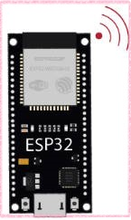
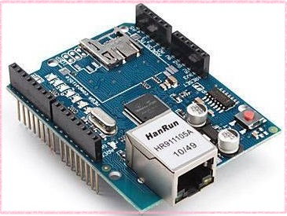
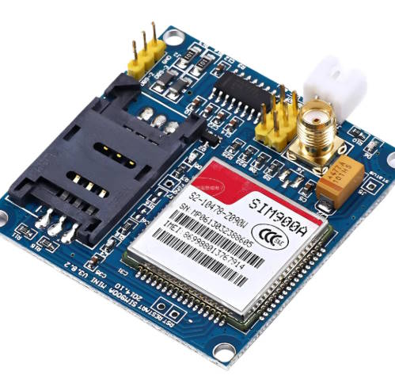
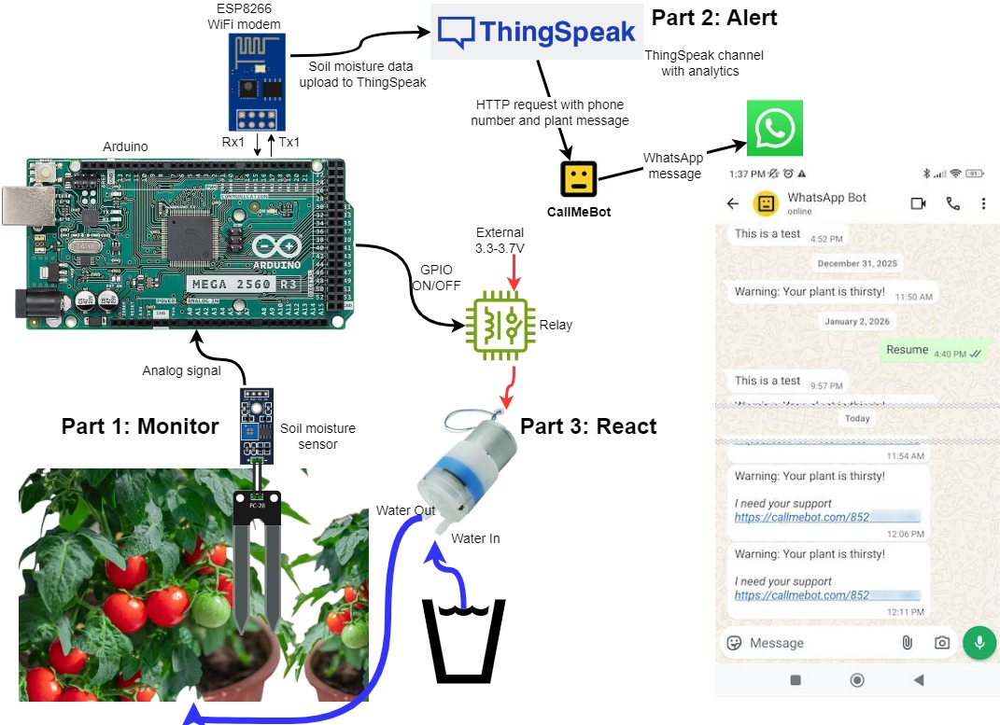

# **IoT Project: The Automated Smart Flowerpot**

Welcome! This project will guide you through building a complete Internet of Things device: a smart flowerpot that monitors its own soil moisture, sends the data to the cloud for monitoring from remote, and automatically waters itself when needed.

## 1. Introduction to IoT

**What is the Internet of Things?**

The Internet of Things (IoT) is a network of everyday physical objects—from vehicles to home appliances—that are embedded with sensors, software, and other technologies to connect and share data over the internet. [Source: IBM](https://www.ibm.com/think/topics/internet-of-things)

In simple terms, IoT turns "dumb" objects into "smart" ones. We can do this in four simple steps:

---

**The 4 Steps to Make a "Thing" Smart**

**Step 1: Picking a "Thing"**

This can be any ordinary object you can think of: a flowerpot, your pet's food bowl, the lock of your door, or even something abstract like the electricity usage of your apartment.

**Step 2: Giving it "Senses" with Sensors**

To know something about the world, our "Thing" needs senses. We add sensors to collect specific data, giving few examples below:
*   A **moisture sensor** for the flowerpot's soil.
*   A **level sensor** for the food bowl.
*   A **magnetic sensor** for your door.
*   **Current and voltage sensors** for the power supply.

**Step 3: Giving it a "Voice" with Internet Connectivity**

Once the sensor has data, the "Thing" needs a way to "speak" to the internet. We add a small computer (a microcontroller) and give it a way to connect to a network. There are several common ways to do this:

*   **Wi-Fi:** This is the most popular method for home and office projects. It's easy and wireless.
    * **Examples:** An ESP32 has Wi-Fi built-in. An Arduino (like MEGA 2560) can use an external Wi-Fi module (ESP8266).

      
    
*   **Ethernet (Wired LAN):** If a physical network cable is available, this is often the most reliable and stable option. It's great for stationary devices where a wired connection is not a problem.
    
    * **Example:** An Arduino with an Ethernet Shield.
    
      
    
*   **Cellular (GSM/3G/4G):** This is perfect for mobile projects or devices in remote locations without Wi-Fi or LAN access. It uses the same technology as your smartphone to connect from almost anywhere.
    
    * **Example:** An Arduino or ESP32 connected to a GSM/GPRS module (like a SIM800L or SIM7600).
    
      

No matter which method you choose, this device's job is to read the sensor and **send the data out to the cloud**. This is the "Internet" part of IoT.

**Step 4: Giving it a "Brain" in the Cloud**

The data needs a destination. A cloud platform (like ThingSpeak) acts as the "brain." Its job is to:
1.  **Listen** for data from your device.
2.  **Store** the data securely.
3.  **Analyze and visualize** the data (e.g., create graphs).
4.  **React** by sending you an alert or allowing you to send a command back to the device.

---

## 2. Project Overview & Learning Objectives

In this demonstration, you will build a system that can:

**Part 1: Monitor**

Read moisture data from a sensor and send it to a ThingSpeak channel in the cloud every 60 seconds.

**Part 2: Alert**

Analyze the data and send an alert to your smartphone if the moisture level gets too low.

**Part 3: React**

Automatically activate a water pump to water the plant when needed, creating a fully automated system.

___

## 3. Step-by-Step Tutorial

This project is broken down into three main parts. Follow them in order to build your smart flowerpot.

### [**Part 1: Hardware Setup**](./docs/1_Hardware_Setup.md)

In this section, you will find the system diagram, the list of required components, and step-by-step instructions for wiring everything together.

### [**Part 2: Software Development**](./docs/2_Software_Development.md)

Here, we will set up the Arduino IDE and write the code for our microcontroller in stages, from calibrating the sensor to the final, complete program.

### [Part 3: Cloud Configuration](./docs/3_Cloud_Configuration.md)

This guide will walk you through setting up your ThingSpeak account, creating a channel to receive data, and configuring the service to send alerts to your phone.

### [Part 4: Advanced Challenges](./docs/4_Advanced_Challenges.md)

Finished the main project and want to take it to the next level? These optional guides will show you how to add more advanced features to your smart flowerpot, such as:
*   [Challenge 1: Porting the project to a more powerful ESP32-S3 Wifi SoC](./docs/4.1_Challenge1_Porting_to_ESP32S3.md).
*   [Challenge 2: Adding a camera to take pictures of your plant.](./docs/4.2_Challenge2_Adding_camera_to_take_pictures.md)
*   [Challenge 3: Uploading the images to Google Drive.](./docs/4.3_Challenge3_Uploading_the_images_to_GoogleDrive.md)
*   [Challenge 4: Implementing real-time remote control using MQTT.](./docs/4.4_Challenge4_Using_MQTT_for_RemoteControl.md)

