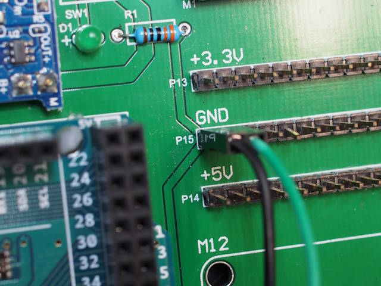
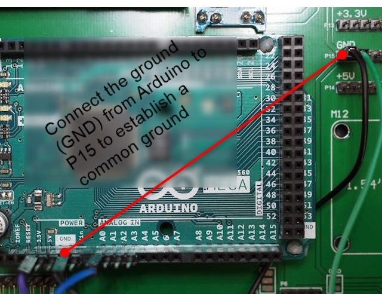

# Hardware Setup

The diagram below illustrates how the different components are connected using our custom lab kit.

Here are some important notes about the connections:

**1. General Lab Kit Setup**

- The Arduino board is separate from the main lab kit board. You will need to use jumper wires to connect the Arduino to the components and power rails on the lab kit.

- Our lab kit includes a DC-DC converter that takes power from a 3.7V Lithium battery and provides two stable power rails: **+5V** (on pin header P14) and **+3.3V** (on pin header P13).

  

- **CRITICAL:** To ensure all components work together, you must connect a ground (GND) pin from the Arduino to the ground pin on the lab kit (pin header P15). This establishes a **common ground** for the entire circuit.

  

  

**2. Connecting the Moisture Sensor**

  - The moisture sensor has four pins: **VCC**, **GND**, **DO** (Digital Out), and **AO** (Analog Out).
  - We will use the analog output to get a detailed moisture reading. Connect the **AO** pin to an analog input pin on the Arduino, such as **A0**.
  - Connect the sensor's **VCC** pin to the **+3.3V** power rail on the lab kit and its **GND** pin to the common ground.

**3. Connecting the ESP8266 Wi-Fi Modem**

- The ESP8266 is a 3.3V device. Connect its **VCC** pin to the **+3.3V** power rail.
- Connect **GND pin of ESP8266** to one of the ground pins of **P15**.
- The ESP8266 communicates with the Arduino using a serial (UART) connection. We will use the Arduino Mega's second serial port, `Serial1`.
- Connect the pins crosswise:
  - Arduino **TX1** (Transmit) pin connects to the ESP8266 **RX** (Receive) pin.
  - Arduino **RX1** (Receive) pin connects to the ESP8266 **TX** (Transmit) pin.

**4. Connecting the Water Pump**

- Connect **Relay 1/2 Input Pin** to one of the GPIO pins on the Arduino, such as **GPIO2**.

- Connect the **positive terminal of the water pump** to one of the **+5V power supply pins on P14**. 

- Connect the **negative terminal of the water pump** to **NO pin of Relay 1/2**.

- Connect the **COM terminal of Relay 1/2 to GND**.

- The water pump requires more power (5V at ~170mA) than an Arduino pin can safely provide (which is limited to ~20mA).

- To control the pump, we must use a **relay module**. The relay acts as a high-power, electronically controlled switch.

- The Arduino will send a simple on/off signal to the relay module. The relay, in turn, will switch the **+5V** power from the lab kit's DC-DC converter to turn the pump on and off.

  - For a detailed guide on how relays work and how to use them, please see

    the following resource: [Relay Driving Guide](https://github.com/kwleung-cityu/Relay_driving.git)
