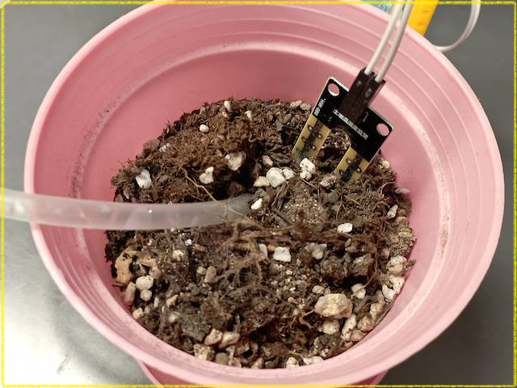

# Software Development

**Writing the Software: A Step-by-Step Approach**
A complete IoT system has many parts that need to work together. Instead of writing one giant program, the best practice is to build and test the system in small, manageable pieces. This makes it much easier to understand and debug.

Our first step is to get a reliable reading from the moisture sensor.

## Part 1: Calibrating the Moisture Sensor

The analog output of the moisture sensor gives us a raw number, not a percentage. This raw value can vary between different sensors and depends on the voltage supplied. To get a meaningful moisture percentage (0% to 100%), we first need to calibrate our specific sensor.

**The Goal:** Find the sensor's raw output value for two extremes:

**0% Moisture:** The sensor is completely dry (in open air).
**100% Moisture:** The sensor is fully submerged in water.

To do this, we will upload a simple program that reads the raw analog value from the sensor and prints it to the Serial Monitor.

**The Calibration Process**

The complete code for this step can be found in the `Code/1_Calibrate_Moisture_Sensor/` folder. 

1. Upload the `1_Calibrate_Moisture_Sensor.ino` code to your Arduino.

2. Open the Serial Monitor (`Tools -> Serial Monitor`) and set the baud rate to **115200**.

3. **Test the "Dry" value:** Hold the sensor in the open air for a few seconds and write down the raw value you see. This will be your 0% moisture reading.

   

4. **Test the "Wet" value:** Dip the sensor prongs completely into a glass of water. Write down the new raw value. This will be your 100% moisture reading.

   

**Example Results**

Your values will be slightly different, but they should look something like this:

- **In Open Air (0% moisture):** The raw value is around **680**.
- **In Water (100% moisture):** The raw value is around **250**.

```
// Example Serial Monitor Output
11:35:06.673 -> Raw Analog Value: 682
11:35:07.641 -> Raw Analog Value: 681
...
11:35:10.670 -> Raw Analog Value: 238
11:35:11.643 -> Raw Analog Value: 237
```

---

## Part 2: Converting Raw Values to a Percentage

Now that we have our unique calibration values, we can write a new program to convert the sensor's raw output into an intuitive 0% to 100% moisture scale. For this, we will use the incredibly useful `map()` function in Arduino.

**The Goal:** Create a program that prints the soil moisture as a percentage.

This program uses the `WET_VALUE` and `DRY_VALUE` you found in Part 1. It reads the sensor's current raw value and mathematically maps it to a 0-100 scale using the `map()` function.

**Important:** Remember to replace the example values in the code with the actual calibration values you recorded for your sensor. The full code is in the `Code/2_Percentage_Moisture/` folder.

The core of the conversion is this single line:
```C++
// The map() function re-scales a number from one range to another.
int moisturePercent = map(rawValue, DRY_VALUE, WET_VALUE, 0, 100);
```

**How the Code Works**

- **`map(rawValue, DRY_VALUE, WET_VALUE, 0, 100)`:** This is the key function. It tells the Arduino: "Take the `rawValue`. If it's equal to `DRY_VALUE`, the result is 0%. If it's equal to `WET_VALUE`, the result is 100%. For any value in between, calculate the proportional percentage."
- **`constrain(moisturePercent, 0, 100)`:** This is a safety function that ensures our final percentage value will never be less than 0 or greater than 100.

**Testing the Program**

The code for this step can be found in the `Code/2_Percentage_Moisture/` folder. 
1. Upload the `2_Percentage_Moisture.ino` code to your Arduino.
2. Open Serial Monitor.
3. Place the sensor in soil with varying levels of moisture. You should now see a clear percentage that reflects how wet the soil is!

```
// Example Serial Monitor Output
Raw: 675  ->  Moisture: 1%
Raw: 510  ->  Moisture: 39%
Raw: 300  ->  Moisture: 88%
```

With this reliable percentage reading, we are now ready to connect our project to the internet and complete the feedback loop.



---

## Part 3A: Uploading moisture data to ThingSpeak - version 1

Now that we can accurately measure soil moisture, the next step is to send this data to the ThingSpeak channel we configured. This will involve writing Arduino code that connects to your Wi-Fi and sends HTTP requests containing the sensor data.

**The Goal:** Upload the soil moisture as a percentage to our ThingSpeak channel that we created in [**Part 3: Cloud Configuration**](../docs/3_Cloud_Configuration.md) and trigger to send a WhatsApp message to your smartphone when the percentage is less than a predefined threshold value.

**Prerequisites:**

* ThingSpeak library by MathWorks should be installed. 

  

* WiFiEsp library by bportaluri should be installed

  

**The complete source code can be found in the `Code/3_ThingSpeak_Upload_Moisture_v1/` folder.** 

This version introduces Wi-Fi connectivity and uploads the data to ThingSpeak. The key function call is `ThingSpeak.writeFields()`. However, as we will see, its main purpose is to demonstrate a flawed, blocking approach.

The most important part of this code to analyze is the `loop()` function, which contains a long, 60-second delay:
```C++
void loop() {
  // ... code to read sensor and set field ...

  // Upload data to ThingSpeak
  ThingSpeak.writeFields(myChannelNumber, myWriteAPIKey);

  // This delay BLOCKS the entire program for 60 seconds!
  delay(60000);
}
```

**Results of running the program:**


To send the soil moisture data to the cloud, the code calls the `ThingSpeak.writeFields()` function. ThingSpeak then automatically adds a timestamp to each new reading as it arrives, which allows us to track the moisture levels over time.

We can test the alert system by simulating a "dry soil" event (0% moisture) by simply taking the sensor out of the water. This low value triggers a 'React' app within ThingSpeak, which is configured to use the ThingHTTP service (see [3_Cloud_Configuration.md](3_Cloud_Configuration.md) for setup details). 


ThingHTTP then sends a REST API request to CallMeBot, an external service that sends a notification to my phone via WhatsApp, as shown in the screenshot below.


**Critique of this Preliminary Version**

The code above works, but it has several major flaws that make it unsuitable for a real-world IoT project.

1.  **Blocking Code with `delay()`:** The most significant problem lies in the use of the `delay()` function. `delay(60000)` pauses the entire program for 60 seconds. During this time, the Arduino can do nothing else—it cannot read other sensors, respond to button presses, or, most importantly, **control a water pump**. This makes the system unresponsive.

2.  **No Offline Resilience:** The program requires a constant internet connection. If the Wi-Fi router is down or the credentials are wrong, the `WiFi.begin(ssid, pass)` call inside the `while` loop will block forever, preventing the device from performing any other tasks, like controlling a pump locally. A robust IoT device should be able to function offline.

3.  **No Power Management:** The code runs in a continuous loop, consuming power at all times. For a battery-powered device that only needs to report data periodically, this is extremely inefficient. A real-world device would use a **deep sleep** mode to conserve battery, waking up only to take a reading and upload data.
Unfortunately, the existing hardware combination **Arduino Mega 2560 + ESP8266** is not well-suited for simple, low-power sleep because we are running two independent chips. We can put the Mega 2560 into a low-power sleep mode, but the ESP8266 module will remain fully powered on and continue to draw a significant amount of current. We will solve this with a standalone ESP32 solution coming next.

For now, we will focus on solving the first two problems. The next section introduces an improved sketch that uses **non-blocking code** and handles connection failures gracefully, creating a more robust foundation for our final project.

## Part 3B: Uploading moisture data to ThingSpeak - version 2

As we discussed, the `v1` sketch has major flaws: its use of `delay()` makes it unresponsive, and its Wi-Fi connection logic can cause the entire program to freeze. This second version (`v2`) solves these problems and adds visual feedback, creating a much more robust and user-friendly foundation.

**The Goal:** Rewrite the program to be non-blocking, resilient, and provide clear visual status updates.

**Key Concepts in the New Code**

1. **Non-Blocking Timing with `millis()`:** The `millis()` function returns the number of milliseconds since the Arduino board began running. By storing the time of the last action (e.g., `previousSensorReadMillis` ) and periodically checking if enough time has passed (`currentMillis - previousSensorReadMillis >= interval`), we can execute tasks at set intervals without ever pausing the entire program.
2. **A Responsive `loop()`:** Because we removed all the long `delay()` calls, the main `loop()` function now runs thousands of times per second. This allows us to check sensors, manage connections, and react to events in near real-time.
3. **Resilient Module Check:** In `setup()`, the code now checks if the ESP8266 module is physically connected and responding. If not, it prints a clear error message and disables all network functions, allowing the rest of the program (like sensor reading and pump control) to run without getting stuck.
4. **Efficient, On-Demand Wi-Fi:** Instead of constantly trying to stay connected, the code now only attempts to connect to Wi-Fi right before it needs to upload data. This is much more efficient and significantly reduces how often the blocking `WiFi.begin()` function pauses the loop.
5. **Visual Status with LEDs:** A new `ledBlinky()` function provides instant visual feedback on the system's status:
   - A **blinking red LED** indicates that there is no Wi-Fi connection (or the module is missing).
   - A **blinking blue LED** provides a clear confirmation that the device is successfully connected to Wi-Fi.

**The Complete V2 Code**
The complete source code can be found in the `Code/4_ThingSpeak_Upload_Moisture_v2/` folder. This new structure is the foundation for our final project. Notice the function `controlWaterPump()`is a placeholder for later implementation.

The key to this non-blocking approach is using `millis()` to check if a certain amount of time has passed before running a task, instead of using `delay()`. The basic pattern looks like this:

```C++
// At the top of your code
unsigned long previousMillis = 0;
const long interval = 1000; // 1 second

void loop() {
  unsigned long currentMillis = millis();

  // Check if it's time to do something
  if (currentMillis - previousMillis >= interval) {
    // Save the time of this action
    previousMillis = currentMillis;

    // ... perform the action (e.g., read a sensor) ...
  }
  
  // The loop continues to run without pausing
}
```

This pattern is applied to the sensor reading, the ThingSpeak upload, and the LED blinking, making the entire sketch responsive.

### Part 4: Automated Watering

This final step closes the loop, creating a fully automated plant watering system. We will integrate a water pump and program the microcontroller to react to changes in soil moisture.

**1. Hardware Setup:**

*   Safely connect a water pump to the microcontroller using a relay module. This is crucial for isolating the high-power pump from the sensitive logic circuits.

**2. Control Logic - Hysteresis:**
To prevent the pump from rapidly switching on and off (a problem known as "chattering") and to avoid over-watering, we will implement a control strategy called **hysteresis**.

Instead of a single "too dry" setpoint, we'll use two thresholds:
* **Low Threshold (e.g., 30% moisture):** If the soil moisture drops *below* this level, turn the pump **ON** for a fixed duration (e.g., 1 second).

* **High Threshold (e.g., 35% moisture):** The pump will remain **OFF** as long as the moisture is *above* the low threshold. This gap prevents the pump from turning on and off with small fluctuations.

Using two different thresholds creates a stable system that doesn't constantly react to minor sensor value changes.

**3. Implementing the Pump Control Function**
We will create a function, `runWaterPumpCycle()`, that runs the pump for a specific amount of time (`onTime`) and then waits for a `soakTime` to allow the water to absorb into the soil before the system continues. The sensor reading will lag behind the actual moisture level, so this soak time is critical to prevent over-watering.

There are two ways to implement this timing: a simple but blocking method using `delay()`, and a more advanced but non-blocking method using `millis()`. We will explore both to understand the trade-offs.

### Method 1: Using `delay()` (The "Easy but Bad" Way)
This is the most straightforward approach. The function will execute its steps in a simple, linear sequence and will not return until the entire cycle (watering and soaking) is complete. This serves as a good example of what *not* to do in a responsive project.

The full code for this example can be found in the `Code/5_Run_WaterPump_with_Delay/` folder.

```C++
// This function is called when moisture is low
void runWaterPumpCycle_with_delay(unsigned int onTime, unsigned int soakTime) {
  // 1. Turn the water pump ON
  digitalWrite(PUMP_RELAY_PIN, HIGH);
  Serial.println("Pump ON");

  // 2. Wait for the 'onTime' duration.
  //    !!! This is a BLOCKING call. The MCU can do nothing else. !!!
  delay(onTime);

  // 3. Turn the water pump OFF
  digitalWrite(PUMP_RELAY_PIN, LOW);
  Serial.println("Pump OFF");

  // 4. Wait for the 'soakTime' to allow water to absorb.
  //    !!! This is also a BLOCKING call. The program is frozen. !!!
  Serial.println("Program trapped in delay(soakTime). You won't see LEDs blinking!");
  delay(soakTime);
  
  Serial.println("Soak time complete. Cycle finished.");
}
```

**Why This Is a Problem:**
*   **Blocking:** While `delay()` is running, the microcontroller is completely frozen. It cannot read sensors, check Wi-Fi status, or respond to any other events.
*   **Unresponsive:** If `onTime` is 1 second and `soakTime` is 20 seconds, your entire device will be unresponsive for 21 seconds. This breaks the non-blocking architecture we worked hard to build.

### Method 2: Using `millis()` (The "Correct" Non-Blocking Way)

This approach uses a **state machine**. Instead of halting the program, it uses the main `loop()` to continuously check if it's time to transition to the next state (e.g., from `WATERING` to `SOAKING`). This allows the device to remain fully responsive to other tasks.

The state machine can be visualized like this:


This requires adding a few global variables to track the current state and the time of the last state change. The full code for this superior method is in the `Code/6_Run_WaterPump_with_Millis/` folder.

```C++
// --- Add these new global variables to track the pump's state ---
enum PumpState { IDLE, WATERING, SOAKING };
PumpState currentPumpState = IDLE;
unsigned long pumpStateChangeMillis = 0; // Tracks time for the current state

// --- This function STARTS the cycle ---
void startWaterPumpCycle() {
  // Only start a new cycle if the pump is currently idle
  if (currentPumpState == IDLE) {
    currentPumpState = WATERING;
    pumpStateChangeMillis = millis(); // Record the time we started watering
    digitalWrite(PUMP_RELAY_PIN, HIGH);
    Serial.println("Pump cycle started: WATERING");
  }
}

// --- This function MANAGES the cycle and is called on every loop ---
void manageWaterPumpCycle(unsigned int onTime, unsigned int soakTime) {
  // State 1: The pump is currently WATERING
  if (currentPumpState == WATERING) {
    if (millis() - pumpStateChangeMillis >= onTime) {
      // Time's up, switch to the SOAKING state
      currentPumpState = SOAKING;
      pumpStateChangeMillis = millis(); // Record the time we started soaking
      digitalWrite(PUMP_RELAY_PIN, LOW);
      Serial.println("Watering finished. Now SOAKING.");
    }
  }
  // State 2: The soil is currently SOAKING
  else if (currentPumpState == SOAKING) {
    if (millis() - pumpStateChangeMillis >= soakTime) {
      // Time's up, the cycle is complete. Return to IDLE.
      currentPumpState = IDLE;
      Serial.println("Soak time complete. Pump cycle finished.");
    }
  }
}

// --- How it's used inside controlWaterPump() ---
void controlWaterPump() {
  // If moisture is too low, start the cycle.
  if(currentMoisturePercent < lowerMoistureThreshold){
    startWaterPumpCycle(); // This just sets the state and returns instantly.
  }
  
  // Manage the pump state on every single loop iteration.
  // This function handles the timing and state changes internally.
  manageWaterPumpCycle(pumpOnTime, pumpSoakTime);  
}
```

**Why This is Better:**
*   **Non-Blocking:** The `manageWaterPumpCycle` function executes and finishes in microseconds, allowing the main `loop()` to continue running freely.
*   **Responsive:** The device can continue to perform all its other tasks (reading sensors, blinking LEDs, checking network status) while the pump cycle is in progress. **This is the correct approach for a robust IoT device.**
*   **More Complex, But More Powerful:** While this method requires more code (an `enum` for state, state-tracking variables, and multiple functions), it is a fundamental pattern for writing reliable embedded software.

---

## What We Learned

Throughout this guide, we have progressed from a simple sensor reading to a complete, automated IoT system. Here are the key software engineering and embedded systems concepts we've put into practice:

1.  **The Importance of Calibration:** We learned that raw sensor data is often not directly useful. Calibrating our sensor against known physical states (completely dry and completely wet) was a critical first step to getting meaningful, real-world data (a percentage).

2.  **Incremental Development:** We did not try to build the entire system at once. We built and tested each component in isolation: first the sensor, then the internet connection, and finally the pump. This iterative approach makes debugging vastly simpler.

3.  **Blocking vs. Non-Blocking Code:** This was the most important lesson. We saw firsthand how using `delay()` (blocking code) in our `v1` sketch and the `delay()` pump example made the entire system unresponsive. We then learned to use the `millis()` function to create non-blocking timers, allowing our final program to handle multiple tasks (reading, uploading, blinking, pumping) concurrently.

4.  **State Machines for Complex Tasks:** To manage the multi-step watering process without blocking, we implemented a simple but powerful state machine (`IDLE`, `WATERING`, `SOAKING`). This is a fundamental pattern in embedded systems for handling any process that unfolds over time.

5.  **Control Theory in Practice (Hysteresis):** We implemented a simple control algorithm (hysteresis) by using two different thresholds for turning the pump on and off. This prevented the system from "chattering" and made the watering cycle stable and predictable.

By following these steps, we have created a robust and reliable piece of software that is far more than just a simple script. It is a small but complete embedded system.

