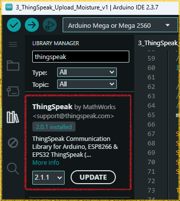
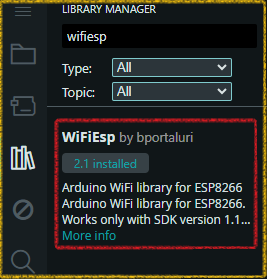
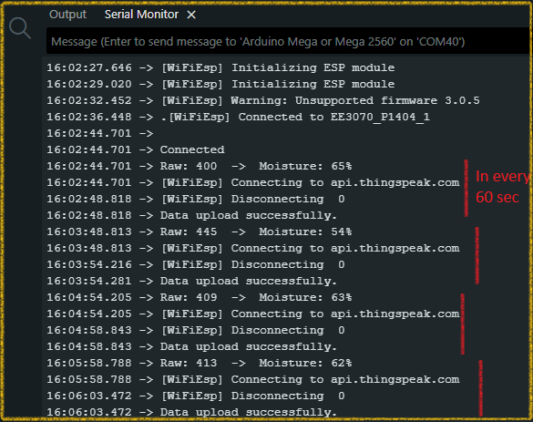
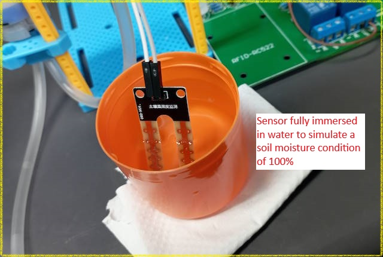
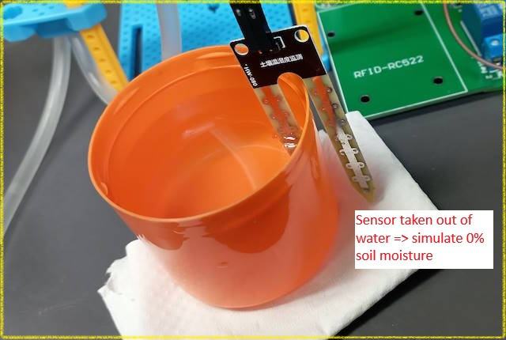
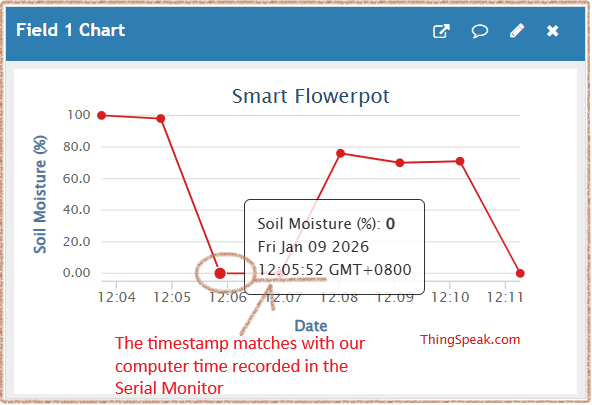
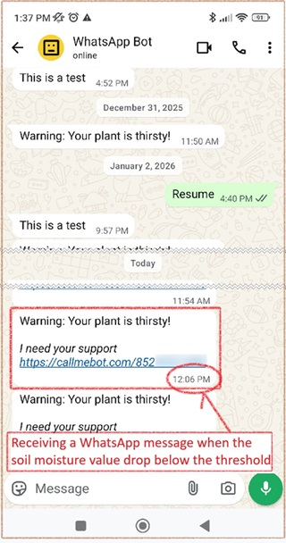

# Software Development

**Writing the Software: A Step-by-Step Approach**
A complete IoT system has many parts that need to work together. Instead of writing one giant program, the best practice is to build and test the system in small, manageable pieces. This makes it much easier to understand and debug.

Our first step is to get a reliable reading from the moisture sensor.

## Part 1: Calibrating the Moisture Sensor

The analog output of the moisture sensor gives us a raw number, not a percentage. This raw value can vary between different sensors and depends on the voltage supplied. To get a meaningful moisture percentage (0% to 100%), we first need to calibrate our specific sensor.

**The Goal:** Find the sensor's raw output value for two extremes:

**0% Moisture:** The sensor is completely dry (in open air).
**100% Moisture:** The sensor is fully submerged in water.

```C
// File: 1_Calibrate_Moisture_Sensor.ino
// Connect the sensor's AO pin to the Arduino's A0 pin.
#define SENSOR_PIN A0 

void setup() {
  // Start the serial communication to see output on the Serial Monitor
  Serial.begin(115200);
}

void loop() {
  // Read the raw analog value from the sensor
  int rawValue = analogRead(SENSOR_PIN);
  
  Serial.print("Raw Analog Value: ");
  Serial.println(rawValue);

  delay(1000); // Wait for one second
}
```

**The Calibration Process**

The code for this step can be found in the `Code/1_Calibrate_Moisture_Sensor/` folder. 

1. Upload the `.ino` code above to your Arduino.
2. Open the Serial Monitor (`Tools -> Serial Monitor`) and set the baud rate to **115200**.
3. **Test the "Dry" value:** Hold the sensor in the open air for a few seconds and write down the raw value you see. This will be your 0% moisture reading.
4. **Test the "Wet" value:** Dip the sensor prongs completely into a glass of water. Write down the new raw value. This will be your 100% moisture reading.

**Example Results**

Your values will be slightly different, but they should look something like this:

- **In Open Air (0% moisture):** The raw value is around **680**.
- **In Water (100% moisture):** The raw value is around **250**.

```
// Example Serial Monitor Output
11:35:06.673 -> Raw Analog Value: 682
11:35:07.641 -> Raw Analog Value: 681
...
11:35:10.670 -> Raw Analog Value: 238
11:35:11.643 -> Raw Analog Value: 237
```

---

## Part 2: Converting Raw Values to a Percentage

Now that we have our unique calibration values, we can write a new program to convert the sensor's raw output into an intuitive 0% to 100% moisture scale. For this, we will use the incredibly useful `map()` function in Arduino.

**The Goal:** Create a program that prints the soil moisture as a percentage.

**1. The Code**

This program uses the `WET_VALUE` and `DRY_VALUE` you found in Part 1. It reads the sensor's current raw value and mathematically maps it to a 0-100 scale.

**Important:** Remember to replace the example values in the code below with the actual calibration values you recorded for your sensor.

```C++
// File: 2_Percentage_Moisture.ino
#define SENSOR_PIN A0 

// === Enter Your Calibration Values Here ===
// Value from when the sensor was in open air (0% moisture)
const int DRY_VALUE = 680; 
// Value from when the sensor was in water (100% moisture)
const int WET_VALUE = 250;  
// ========================================

void setup() {
  Serial.begin(115200);
}

void loop() {
  int rawValue = analogRead(SENSOR_PIN);
  
  // The map() function re-scales a number from one range to another.
  // Notice that our raw value goes DOWN as moisture goes UP. 
  // We map the range [DRY_VALUE, WET_VALUE] to the range [0, 100].
  int moisturePercent = map(rawValue, DRY_VALUE, WET_VALUE, 0, 100);

  // The constrain() function keeps the value within the 0-100 range,
  // which is useful if the sensor reading ever goes slightly outside
  // our calibration range.
  moisturePercent = constrain(moisturePercent, 0, 100);

  Serial.print("Raw: ");
  Serial.print(rawValue);
  Serial.print("  ->  Moisture: ");
  Serial.print(moisturePercent);
  Serial.println("%");

  delay(1000);
}
```

**2. How the Code Works**

- **`DRY_VALUE` and `WET_VALUE`:** We store our calibration numbers in constant variables at the top of the code. This makes them easy to find and change.
- **`map(rawValue, DRY_VALUE, WET_VALUE, 0, 100)`:** This is the core of our conversion. It tells the Arduino: "Take the `rawValue`. If it's equal to `DRY_VALUE` (680), the result is 0%. If it's equal to `WET_VALUE` (250), the result is 100%. For any value in between, calculate the proportional percentage." The function is smart enough to handle the fact that our "from" range is inverted (from a high number to a low one).
- **`constrain(moisturePercent, 0, 100)`:** This is a safety function. It ensures that our final `moisturePercent` value will never be displayed as less than 0 or greater than 100, even if there's a strange spike in the sensor reading.

**3. Testing the Program**

The code for this step can be found in the `Code/2_Percentage_Moisture/` folder. 

1. Upload the new code to your Arduino.
2. Open Serial Monitor.
3. Place the sensor in soil with varying levels of moisture. You should now see a clear percentage that reflects how wet the soil is!

```
// Example Serial Monitor Output
Raw: 675  ->  Moisture: 1%
Raw: 510  ->  Moisture: 39%
Raw: 300  ->  Moisture: 88%
```

With this reliable percentage reading, we are now ready to connect our project to the internet and complete the feedback loop.

---

## Part 3A: Uploading moisture data to ThingSpeak

Now that we can accurately measure soil moisture, the next step is to send this data to the ThingSpeak channel we configured. This will involve writing Arduino code that connects to your Wi-Fi and sends HTTP requests containing the sensor data.

**The Goal:** Upload the soil moisture as a percentage to our ThingSpeak channel that we created in [**Part 3: Cloud Configuration**](../docs/3_Cloud_Configuration.md) and trigger to send a WhatsApp message to your smartphone when the percentage is less than a predefined threshold value.

**Prerequisites:**

* ThingSpeak library by MathWorks should be installed. 

  

* WiFiEsp library by bportaluri should be installed

  

**Only new code** relevant to WiFi connection and ThingSpeak code are listed below. 

**The complete source code can be found in the `Code/3_ThingSpeak_Upload_Moisture_v1/` folder.** 

````C++
#include "ThingSpeak.h"
#include "WiFiEsp.h"

#define ESP_BAUDRATE  115200
char ssid[] = "YOUR_SSID";        // your network SSID (name) 
char pass[] = "YOUR_PASSWORD";    // your network password

const unsigned long myChannelNumber = 123456;             //replace it with your channel number
const char *myWriteAPIKey = "channel_write_apikey";       //replace it with your channel write api key
const unsigned int moistureFieldNumber = 1; 

WiFiEspClient thingspeakClient;

//existing code...

void setup() {
    //existing code...
	WiFi.init(&Serial1);  //using Serial1 for ESP8266 modem
  	// check for the presence of the shield
  	if (WiFi.status() == WL_NO_SHIELD) {
    	Serial.println("WiFi shield not present");
    	// don't continue
    	while (true);
  	}
  	// Connect or reconnect to WiFi
  	if(WiFi.status() != WL_CONNECTED){
    	while(WiFi.status() != WL_CONNECTED){
      	Serial.print(".");
      	WiFi.begin(ssid, pass);
      	delay(500);     
    	} 
    Serial.println("\nConnected");
  	}

  	ThingSpeak.begin(thingspeakClient); //initialize ThingSpeak client    
}

void loop() {
	bool upload_success_flag = false;
    //existing code...
  	ThingSpeak.setField(moistureFieldNumber, moisturePercent);

      while(!upload_success_flag){
        int status_code = ThingSpeak.writeFields(myChannelNumber, myWriteAPIKey);
        if(status_code == 200){
          Serial.println("Data upload successfully.");
          upload_success_flag = true;
        } else {
          Serial.println("Problem updating field.  HTTP error code " + String(status_code));
          Serial.println("Retrying...");
          delay(15000); //cannot write more frequent than 15sec with free ThingSpeak account
        }
      }

  delay(60000);     //new value in 60sec interval    
}
````

**Results of running the program:**







To send the soil moisture data to the cloud, the code calls the `ThingSpeak.writeFields()` function. ThingSpeak then automatically adds a timestamp to each new reading as it arrives, which allows us to track the moisture levels over time.

We can test the alert system by simulating a "dry soil" event (0% moisture) by simply taking the sensor out of the water. This low value triggers a 'React' app within ThingSpeak, which is configured to use the ThingHTTP service (see [3_Cloud_Configuration.md](3_Cloud_Configuration.md) for setup details). 



ThingHTTP then sends a REST API request to CallMeBot, an external service that sends a notification to my phone via WhatsApp, as shown in the screenshot below.



**Critique of this Preliminary Version**

The code above works, but it has a major flaw that makes it unsuitable for a real-world IoT project. The problem lies in the use of the `delay()` function:

- **`delay(60000)`:** This line pauses the entire program for 60 seconds.
- **`delay(15000)`:** This line pauses the program for 15 seconds if a ThingSpeak upload fails.

During these delays, the Arduino can do nothing else. It cannot read other sensors, it cannot respond to button presses, and most importantly, **it cannot control a water pump**. If we were to add code to turn on a pump, it would only be checked once every minute, which is not responsive enough for a real-time system.

This "blocking" approach is simple to understand, but it's not scalable. A better practice is to write **non-blocking code** and to **modularize** the program by breaking it down into smaller, independent functions (e.g., one function for reading the sensor, another for handling WiFi, and a third for uploading data).

In the next section, we will improve this sketch to solve these problems, creating a more robust foundation for our final project.

## Part 3B: Uploading moisture data to ThingSpeak - an improved version

As we discussed, the `delay()` function in our first version makes our program "blocking," which is not ideal. To build a scalable IoT device, we need our code to be responsive and capable of handling multiple tasks at once.

This second version (`v2`) of the program solves this problem by replacing `delay()` with a non-blocking timing mechanism using the `millis()` function. This is a fundamental best practice in Arduino programming.

**The Goal:** Rewrite the program to be non-blocking and modular, creating a stable foundation for adding a water pump later.

**Key Concepts in the New Code**

1.  **Non-Blocking Timing with `millis()`:** The `millis()` function returns the number of milliseconds since the Arduino board began running. By storing the time of the last action (e.g., `previousSensorReadMillis`) and periodically checking if enough time has passed (`currentMillis - previousSensorReadMillis >= interval`), we can execute tasks at set intervals without ever pausing the entire program.

2.  **A Responsive `loop()`:** Because we removed all the long `delay()` calls, the main `loop()` function now runs thousands of times per second. This allows us to check sensors, manage connections, and react to events in near real-time.

3.  **Modular Functions:** The code is now broken down into smaller, single-purpose functions like `readMoisture()`, `uploadToThingSpeak()`, and `connectWiFi()`. This makes the program much easier to read, understand, and debug.

**The Complete V2 Code**

The complete source code can be found in the `Code/4_ThingSpeak_Upload_Moisture_v2/` folder. This new structure is the foundation for our final project. Notice the placeholder function `controlWaterPump()`—because the main loop is non-blocking, we can now add our pump logic here without disrupting the other tasks.

```C++
// File: 4_ThingSpeak_Upload_Moisture_v2.ino
/********************************************************************************
 * File: 4_ThingSpeak_Upload_Moisture_v2.ino
 * 
 * Description:
 * This sketch is an improved, non-blocking version for reading a soil moisture
 * sensor and uploading the data to ThingSpeak. It avoids using delay() by
 * tracking time with the millis() function. This allows the program to remain
 * responsive and handle multiple tasks concurrently, such as checking sensor
 * values, managing a Wi-Fi connection, and (in the future) controlling a 
 * water pump.
 * 
 * Key Improvements from v1:
 * 1. Non-Blocking Timing: Uses millis() instead of delay() to manage sensor 
 *    reading and data upload intervals.
 * 2. Modular Functions: Code is broken into smaller, single-purpose functions
 *    (e.g., readMoisture(), handleWiFi(), uploadToThingSpeak()).
 * 3. Responsive Loop: The main loop() runs continuously, allowing for near
 *    real-time control and responsiveness.
 * 4. Scalability: This structure makes it easy to add new features, like a
 *    water pump, without rewriting the core logic.
 * 
 * Hardware Connections (as per 1_Hardware_Setup.md):
 * - Moisture Sensor AO -> Arduino A0
 * - ESP8266 TX/RX     -> Arduino RX1/TX1 (Serial1)
 * - Water Pump Relay  -> Arduino GPIO2
 * 
 ********************************************************************************/

// --- Libraries ---
#include "ThingSpeak.h"
#include "WiFiEsp.h"

// --- Hardware Pin Definitions ---
#define SENSOR_PIN A0 
#define PUMP_RELAY_PIN 2

// --- enable/disable ThingSpeak at compile time ---
// comment to disable ThingSpeak uploads  
// #define THINGSPEAK_ENABLE

// --- Sensor Calibration ---
// Replace these with the values you found in the calibration step
const int DRY_VALUE = 680; // Raw ADC value for 0% moisture (in air)
const int WET_VALUE = 250; // Raw ADC value for 100% moisture (in water)

// --- Wi-Fi & ThingSpeak Configuration ---
#define ESP_BAUDRATE 115200
char ssid[] = "YOUR_SSID";     // Your network SSID (name)
char pass[] = "YOUR_PASSWORD"; // Your network password

const unsigned long myChannelNumber = 123456;        // Your ThingSpeak channel number
const char *myWriteAPIKey = "channel_write_apikey";  // Your ThingSpeak Write API Key
const unsigned int moistureFieldNumber = 1;          // Field number for moisture data

// --- Global Variables ---
WiFiEspClient thingspeakClient;
int currentMoisturePercent = 0; // Holds the latest sensor reading

// --- Timing Control (Non-Blocking) ---
// Used to track time for various tasks without using delay()
unsigned long previousSensorReadMillis = 0;
unsigned long previousThingSpeakUploadMillis = 0;

// Set the intervals for how often tasks should run (in milliseconds)
const long sensorReadInterval = 5000;       // Read sensor every 5 seconds
const long thingSpeakUploadInterval = 60000; // Upload to ThingSpeak every 60 seconds

// --- Function Prototypes ---
void connectWiFi();
void readMoisture();
void uploadToThingSpeak();
void controlWaterPump();

// ==============================================================================
// SETUP: Runs once when the Arduino starts up
// ==============================================================================
void setup() {
  Serial.begin(SERIAL_MON_BAUDRATE);
  Serial1.begin(ESP_BAUDRATE); // Initialize Serial1 for ESP8266 modem
  delay(500); //a short delay to let Serial port settle
    
  pinMode(PUMP_RELAY_PIN, OUTPUT);
  digitalWrite(PUMP_RELAY_PIN, LOW); // Ensure pump is OFF by default

  connectWiFi(); // Initial attempt to connect to Wi-Fi

  ThingSpeak.begin(thingspeakClient); // Initialize ThingSpeak client
}

// ==============================================================================
// LOOP: Runs continuously and is kept non-blocking
// ==============================================================================
void loop() {
  // Get the current time at the start of the loop
  unsigned long currentMillis = millis();

  // Task 1: Maintain Wi-Fi Connection (runs on every loop)
  // If Wi-Fi disconnects, this will attempt to reconnect.
  if (WiFi.status() != WL_CONNECTED) {
    connectWiFi();
  }

  // Task 2: Read the moisture sensor at its specified interval
  if (currentMillis - previousSensorReadMillis >= sensorReadInterval) {
    previousSensorReadMillis = currentMillis; // Save the time of this reading
    readMoisture();
  }

  // Task 3: Upload data to ThingSpeak at its specified interval 
  // with conditional compilation (#define THINGSPEAK_ENABLE)
  #if defined(THINGSPEAK_ENABLE)
  if (currentMillis - previousThingSpeakUploadMillis >= thingSpeakUploadInterval) {
    previousThingSpeakUploadMillis = currentMillis; // Save the time of this upload
    uploadToThingSpeak();
  }
  #endif

  // Task 4: Control the water pump (runs on every loop)
  // This function will contain the logic to turn the pump on/off based on moisture
  controlWaterPump();
}

// ==============================================================================
// --- Helper Functions ---
// ==============================================================================

/**
 * @brief Connects to the Wi-Fi network.
 * It will block until a connection is established.
 */
void connectWiFi() {
  WiFi.init(&Serial1);
  if (WiFi.status() == WL_NO_SHIELD) {
    Serial.println("ERROR: WiFi shield not present");
    while (true); // Halt execution
  }

  Serial.print("Attempting to connect to SSID: ");
  Serial.println(ssid);

  while (WiFi.status() != WL_CONNECTED) {
    WiFi.begin(ssid, pass);
    Serial.print(".");
    delay(2000); // Use a short delay ONLY for connection attempts
  }

  Serial.println("\nWiFi Connected!");
  Serial.print("IP Address: ");
  Serial.println(WiFi.localIP());
}

/**
 * @brief Reads the moisture sensor and updates the global variable.
 */
void readMoisture() {
  int rawValue = analogRead(SENSOR_PIN);
  
  // Map the raw value to a percentage
  currentMoisturePercent = map(rawValue, DRY_VALUE, WET_VALUE, 0, 100);
  
  // Constrain the value to the 0-100 range to prevent invalid readings
  currentMoisturePercent = constrain(currentMoisturePercent, 0, 100);

  Serial.print("Sensor Reading -> Raw: ");
  Serial.print(rawValue);
  Serial.print(", Moisture: ");
  Serial.print(currentMoisturePercent);
  Serial.println("%");
}

/**
 * @brief Uploads the current moisture percentage to ThingSpeak.
 */
void uploadToThingSpeak() {
  if (WiFi.status() != WL_CONNECTED) {
    Serial.println("Cannot upload data: WiFi not connected.");
    return;
  }

  Serial.println("Uploading data to ThingSpeak...");
  ThingSpeak.setField(moistureFieldNumber, currentMoisturePercent);

  int httpCode = ThingSpeak.writeFields(myChannelNumber, myWriteAPIKey);

  if (httpCode == 200) {
    Serial.println("ThingSpeak upload successful.");
  } else {
    Serial.println("Problem uploading to ThingSpeak. HTTP error code " + String(httpCode));
    // Note: No delay() or while() loop here. If it fails, it will simply
    // try again on the next scheduled interval.
  }
}

/**
 * @brief Placeholder function for water pump control logic.
 * This function can now be called on every loop without being blocked.
 */
void controlWaterPump() {
  // This is where you would add the logic to control the pump.
  // For example:
  // if (currentMoisturePercent < 30) {
  //   digitalWrite(PUMP_RELAY_PIN, HIGH); // Turn pump ON
  // } else {
  //   digitalWrite(PUMP_RELAY_PIN, LOW);  // Turn pump OFF
  // }
}
```


## Part 4: React - Closing the Loop with Automated Watering

*   Safely connect a water pump to the Arduino using a relay module.
*   Modify the Arduino code to automatically activate the water pump when the moisture level drops below the safe range.