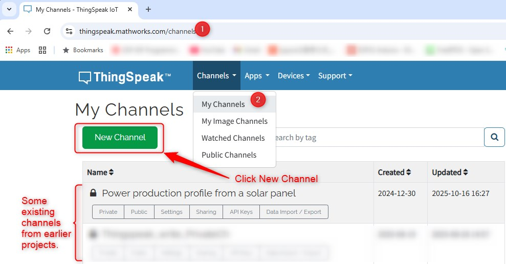
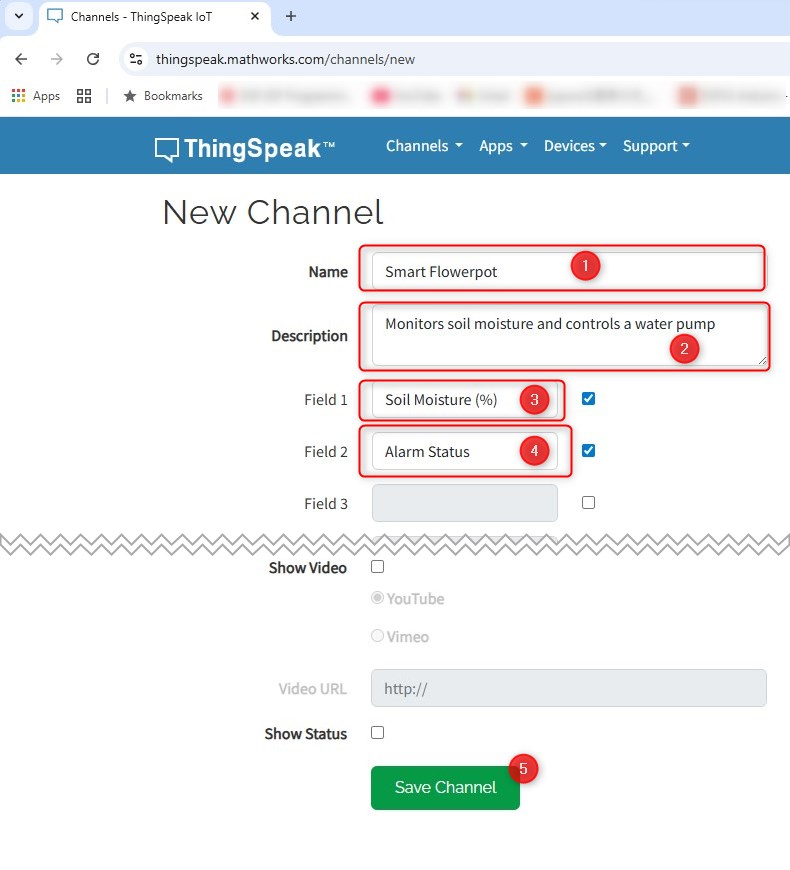
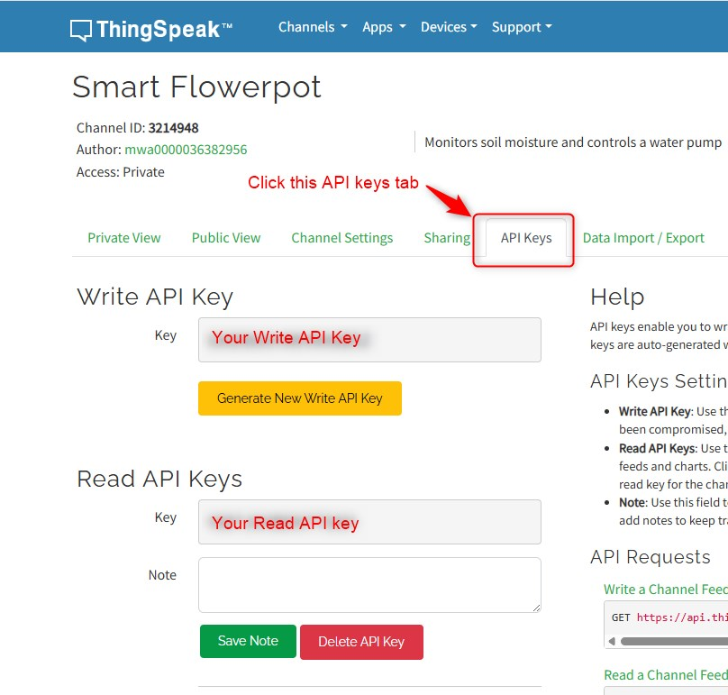
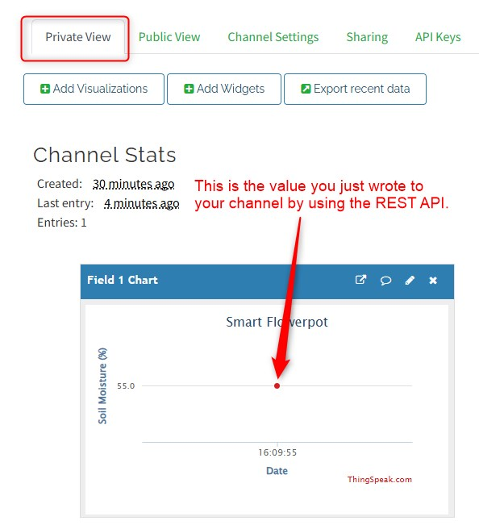

# Part 3: Cloud Configuration with ThingSpeak

## What is the "Cloud"?

Before we begin, let's quickly define the "Cloud." In technology, the "cloud" refers to on-demand access to shared computing resources—like servers, storage, and software—delivered over the internet. For our project, ThingSpeak is a cloud service that will act as the "brain," allowing us to store, view, and react to our sensor data from anywhere in the world.

## Step 1: Create Your ThingSpeak Account and Channel

  First, we need to set up a destination for our data.

  1. **Create an Account:** Go to [ThingSpeak.com](https://thingspeak.mathworks.com/) and create a free account. You may need to verify your email address.

  2. **Create a New Channel:** Once logged in, click on **"Channels"** and then **"My Channels."** Click the **"New Channel"** button.

     

  3. **Configure the Channel:** Fill out the form with the following information:

     - **Name:** `Smart Flowerpot` (or any name you like)
     - **Description:** `Monitors soil moisture and controls a water pump.`
     - **Field 1:** Check the box to enable it and name it `Soil Moisture (%)`.
     - **Field 2:** Check the box to enable it and name it `Alarm Status`.
     - Scroll down and click **"Save Channel."**

     

## Step 2: Find Your API Keys

API (Application Programming Interface) keys are like a secret username and password that allow your device to securely send data to your channel.

  1. After saving your channel, click on the **"API Keys"** tab.

  2. You will see two important keys:

     - **Write API Key:** This is the key your Arduino will use to *send* data to ThingSpeak.
     - **Read API Key:** This is used if you want to *read* data from ThingSpeak.

  3. **Copy the "Write API Key."** This is the most important key for now. You will need to paste this into your Arduino code later. **Keep it secret!**

     

## Step 3: Test Your Channel with a Web Browser (REST API)

Before writing any Arduino code, we can test that our channel is working by sending data directly from a web browser. This is a simple way to use the ThingSpeak **REST API** - **Representational State Transfer Application Programming Interface**. The **REST-API** is a set of rules for how computer systems can exchange resources (photos, a blog post, sensor readings, etc) to each other over the Internet.

1. Copy your **Write API Key**.

2. Construct the following URL in a text editor, replacing `YOUR_API_KEY` with the **Write API key** you just copied and choosing a test value (e.g., `55`).

   ```http
   https://api.thingspeak.com/update?api_key=YOUR_API_KEY&field1=55
   ```

3. Paste the complete URL into your web browser's address bar and press Enter.

   

4. Go back to your ThingSpeak channel and click on the **"Private View"** tab. You should see a new data point with the value `55` on your "Soil Moisture" chart! This confirms your channel is working correctly.

   

------

## Step 4: Set Up the Smartphone Alert

Now, let's make ThingSpeak send an alert when the plant is thirsty. We need to use three services to make this work:

* **CallMeBot** - This is a versatile web service and API that allows users to send automated notifications, text messages, and even voice calls to popular messaging platforms and standard phone lines. In this demo we are going to configure WhatsApp Messages to send from CallMeBot when the plant is thirsty.

* **React** app of ThingSpeak - This is the **"Trigger."** Its job is to constantly watch your channel's data - "WHEN Field 2 of my channel becomes equal to 1, call ThingHTTP app"

* **ThingHTTP** app of ThingSpeak - This is the **"Action."** Its job is to make an HTTP request to CallMeBot to make an instant notification to a registered phone number 

  #### **Step 4A: Configure CallMeBot**

  #### **Step 4B: Configure the `React` Trigger**

  We'll tell ThingSpeak *when* to perform the action you just created.

  1. Go to the **"Apps"** menu and select **"React."**
  2. Click **"New React."**
  3. Fill out the form:
     - **Name:** `Low Moisture React`
     - **Condition Type:** `Numeric`
     - **Test Frequency:** Select `On data insertion`.
     - **Condition:** `If channel [Your Channel ID] field [2] is equal to [1]`
     - **Action:** Select `ThingHTTP` from the dropdown menu.
     - **ThingHTTP to execute:** A new dropdown will appear. Select the **`Send WhatsApp Alert`** ThingHTTP you created in the previous step.
  4. Click **"Save React."**
  
  #### **Step 4C: Configure the `ThingHTTP` Action**
  
  We first need to teach ThingSpeak *how* to talk to the CallMeBot API.
  
  1. In ThingSpeak, go to the **"Apps"** menu and select **"ThingHTTP."**
  
  2. Click **"New ThingHTTP."**
  
  3. Fill out the form with the following details:
  
     - **Name:** `Send WhatsApp Alert`
  
     - **URL:** `https://api.callmebot.com/whatsapp.php`
  
     - **Method:** `GET`
  
     - **Content Type:** `application/x-www-form-urlencoded`
  
     - **Body:** Leave this field **blank**.
  
     - **Parameters:**
  
       This is the most important part. You need to add three parameters. Click "Add Parameter" for each one:
  
       - **Name 1:** `phone` -> **Value 1:** `[Your_Phone_Number]` (e.g., `+1234567890`)
       - **Name 2:** `text` -> **Value 2:** `Warning: Your plant is thirsty!` (You can customize this message).
       - **Name 3:** `apikey` -> **Value 3:** `[Your_CallMeBot_API_Key]`
  
  4. Click **"Save ThingHTTP."**
  
  #### **Step 4D: Validation**
  
  
