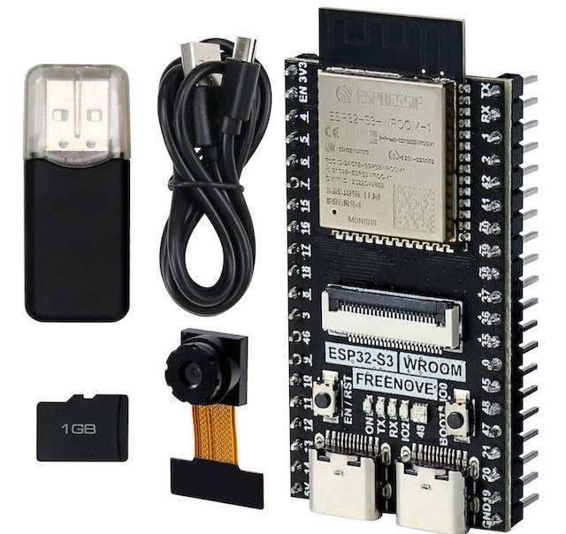
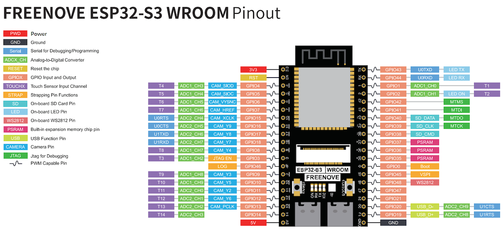
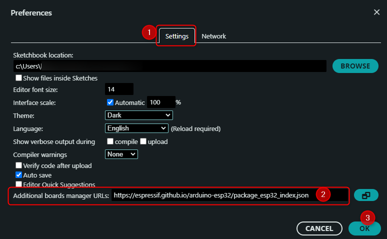
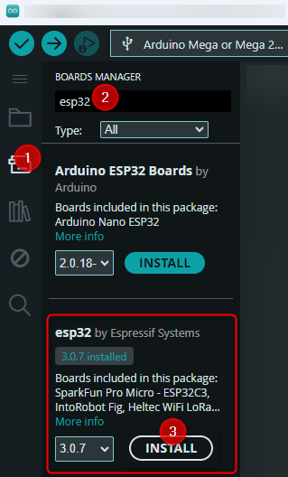
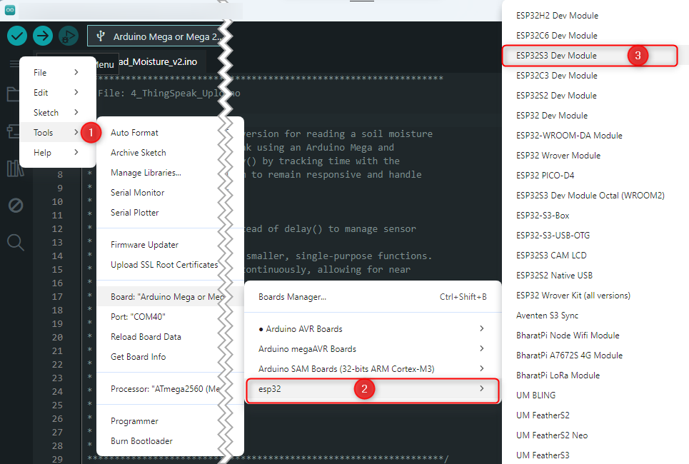
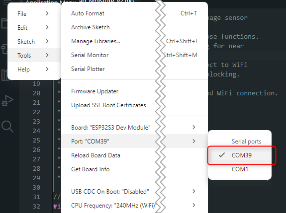

# Advanced Challenges

This section provides guides for the advanced challenges to extend the functionality of your Smart Flowerpot project.

**Objective:** Upgrade the project from the Arduino Mega 2560 + ESP8266 combination to a more powerful, all-in-one ESP32 or ESP32-S3 System-on-Chip (SoC).

**Why do this?**
- **Simplicity:** The ESP32 has built-in Wi-Fi, removing the need for a separate Wi-Fi module and complex serial communication between two chips.
- **Power:** The ESP32 is significantly more powerful than the Arduino Mega, with a faster dual-core processor, more RAM, and more GPIO pins.
- **Future-Proofing:** This architecture is more modern and opens the door to more complex tasks like running a web server, handling Bluetooth communication, or using a camera.

**What you will learn:**

- How to set up the Arduino IDE for ESP32 development.
- How to adapt the existing code to run on the ESP32 platform.
- The benefits of using an integrated SoC for IoT projects.

---
## Hardware
A kit with a Freenove® ESP32-S3 WROOM (FNK0085) Board for learning programming and electronics.

Official web site: https://store.freenove.com/products/fnk0085

User guide and tutorial download link: https://freenove.com/fnk0085





## Installing the ESP32-S3 Board in Arduino IDE

Follow these steps to set up your Arduino IDE for the Freenove ESP32-S3 board.

1.  **Add the ESP32 Boards Manager URL:**
    *   In the Arduino IDE, go to **File > Preferences**.
    *   In the "Additional boards manager URLs" field, paste the following link:
        ```
        https://espressif.github.io/arduino-esp32/package_esp32_index.json
        ```
    *   Click **OK**.

    

2.  **Install the ESP32 Core:**
    *   Open the Boards Manager by clicking the icon on the left sidebar or by going to **Tools > Board > Boards Manager...**.
    *   Search for `esp32` and find the entry by **Espressif Systems**.
    *   Select a version later than `2.0.4` (this tutorial uses `3.0.7`) and click **Install**.

    

3.  **Install the USB Driver:**
    *   The ESP32-S3 board uses a CH343 chip for USB communication. You will need to install a driver for it.
    *   Download the driver **CH343SER.ZIP** from [this link (CH343SER.ZIP)](https://learn.adafruit.com/how-to-install-drivers-for-wch-usb-to-serial-chips-ch9102f-ch9102/windows-driver-installation).
    *   Unzip the downloaded file, open the folder, and run the **SETUP.EXE** installer.

4.  **Connect the Board and Select the Port:**
    
    *   Connect the ESP32-S3 board to your computer using a USB Type-C cable. Use the USB socket located next to the "BOOT" button.
    *   In the Arduino IDE, go to **Tools > Board > esp32** and select **ESP32S3 Dev Module**.
    *   Go to **Tools > Port** and select the new COM port that appeared after connecting the board.
    
    

You will see a new COM port under ESP32S3 Dev Module.




5. **Next step:** Proceed to [Challenge 1](../docs/4.1_Challenge1_Porting_to_ESP32S3.md) to port the project to this more powerful ESP32-S3 Wifi Soc 

