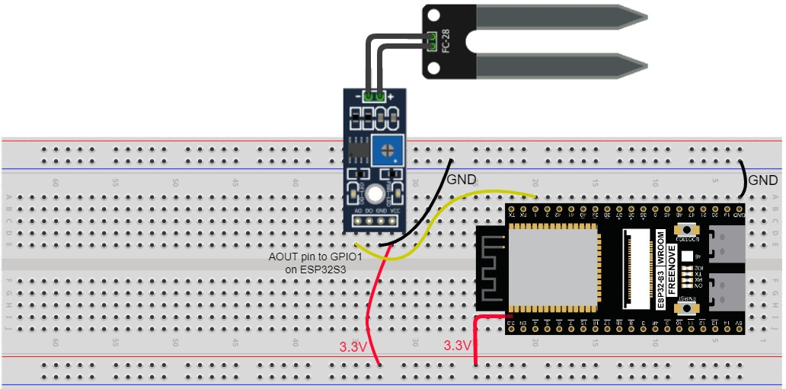
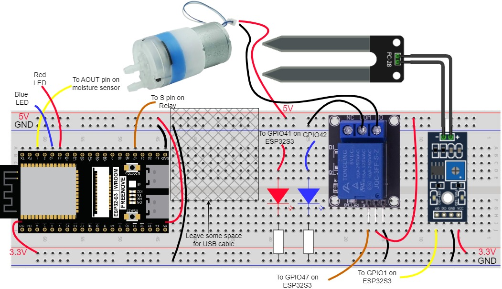

# Challenge 1: Porting the project to ESP32-S3 Wifi SoC

## Wiring up the sensor and actuator

Now that we are familiar with the ESP32-S3 (abbreviated as ESP32 below) board, let's connect the soil moisture sensor and the water pump.

### Soil Moisture Sensor

The soil moisture sensor has three pins: VCC, GND, and AOUT.

-   Connect **VCC** to the **3.3V** pin on the ESP32.
-   Connect **GND** to the **GND** pin on the ESP32.
-   Connect **AOUT** (Analog Out) to a GPIO pin that can be used as an Analog-to-Digital Converter (ADC) input. For this project, we will use **GPIO 1**.

*Note: The image above is a simplified representation. Ensure your connections are secure, preferably on a breadboard.*

### Water Pump and LEDs

The water pump is controlled by a relay module. The relay helps us control a higher voltage device (like the pump, which may require 5V or more) using a low-voltage signal from the ESP32 (3.3V).

The relay module has 3 pins for control **(S, +, -)** and 3 pins for the load **(NC, COM, NO)**.

-   Connect the relay's **+** to **5V** on the ESP32. This 5V is provided by the USB port when ESP32 is connected to the PC. 
-   Connect the relay's **-** to a **GND** pin on the ESP32.
-   Connect the relay's **S** (Input) pin to a digital GPIO pin on the ESP32. We will use **GPIO 38**.

**For the pump itself:**

- Connect the **NO** (Normally Open) terminal of the relay to the negative (black) wire of the water pump.

- Connect the **COM** (Common) terminal of the relay to the negative terminal of the external power supply (e.g. GND on ESP32).

- Connect the positive (red) wire of the water pump to an external power supply (e.g., 5V on ESP32). **Note that if you are using the 5V from the USB port of your computer, the total current drawn by your project should not exceed 500mA.**

**For the LEDs:**

- Connect the Blue LED's anode to GPIO42 on ESP32 and the LED's cathode connected to ground through a current limiting resistor of 51~120 Ohm.

- Connect the Red LED's anode to GPIO41 on ESP32 and the LED's cathode connected to ground through a current limiting resistor of 390~470 Ohm.

> **CAUTION:** To prevent damage to your hardware, always double-check your wiring connections before connecting any external power source.

## Porting the software to ESP32-S3

The full source code is found in the `Code/7_Run_WaterPump_with_Millis_ESP32/` folder.

With the hardware wired up, the next step is to adapt the Arduino code to run on the ESP32. The core logic remains the same, but we need to account for differences in pin numbers, analog pins, and how the ESP32 handles WiFi connection.

### Key Code Modifications

1. **Update WiFi library:** ESP32-S3 has built-in WiFi module therefore no external esp8266 modem is required.

   | ESP32-S3 version                                             | Mega2560 + ESP8266 version                                   |
   | ------------------------------------------------------------ | ------------------------------------------------------------ |
   | **#include <WiFi.h>**  ~~**#define ESP_BAUDRATE 115200; Serial1.begin(ESP_BAUDRATE); WiFi.init(&Serial1);**~~  **connectWiFi();** | **#include "WiFiEsp.h"** **//...existing code \#define ESP_BAUDRATE 115200 //...existing code Serial1.begin(ESP_BAUDRATE ); //...existing code WiFi.init(&Serial1);** |

2. **Update Pin Definitions:** new pin numbers to match the new wiring.

   | ESP32-S3 version                                             | Mega2560 + ESP8266 version                                   |
   | ------------------------------------------------------------ | ------------------------------------------------------------ |
   | //different GPIO pinout on ESP32-S3 **#define SENSOR_PIN       1 #define PUMP_RELAY_PIN 38  #define LED_RED_PIN          41 #define LED_BLUE_PIN        42** |  **#define SENSOR_PIN           A0 \#define PUMP_RELAY_PIN 2 \#define LED_RED_PIN          3 \#define LED_BLUE_PIN        4** |
   
1. **Analog-to-Digital Converter (ADC) Resolution:** The Arduino Mega uses a 10-bit ADC, which gives analog readings from 0 to 1023. The ESP32-S3 has a more precise 12-bit ADC, resulting in a range from 0 to 4095.
   
   This means the values you get from `analogRead(sensorPin)` will be different. You will need to **re-calibrate your sensor** using the `1_Calibrate_Moisture_Sensor.ino` sketch to find the new "wet" and "dry" values for the ESP32-S3.
   
   Your `map()` function to convert the raw reading to a percentage will need to use these new calibrated values.
   
   | ESP32-S3 version                                             | Mega2560 + ESP8266 version                                   |
   | ------------------------------------------------------------ | ------------------------------------------------------------ |
   | // Example values - you MUST find your own by calibrating! **const int DRY_VALUE = 4095;** // Raw ADC value for 0% moisture (in air) **const int WET_VALUE = 1300;** // Raw ADC value for 100% moisture (in water) |  **const int DRY_VALUE = 680; const int WET_VALUE = 250;** |
   
2. **Update WiFi client**:
   
   | ESP32-S3 version                                             | Mega2560 + ESP8266 version              |
   | ------------------------------------------------------------ | --------------------------------------- |
   | //use library for internal WiFi module **WiFiClient thingspeakClient;** |  **WiFiEspClient thingspeakClient;** |
   
5. **Remove redundant variable:** there is no need to check ESP8266 and Arduino connections because the WiFi module is built-in ESP32-S3
   
   | ESP32-S3 version                     | Mega2560 + ESP8266 version       |
   | ------------------------------------ | -------------------------------- |
   | **~~bool isWifiModuleOK = false;~~** | **bool isWifiModuleOK = false;** |

### Key Improvements with ESP32-S3:

   * Simplified Codebase: The ESP32-S3 has a built-in Wi-Fi module, which eliminates the need for a separate ESP8266 and the complex serial communication between two microcontrollers. This results in cleaner and more straightforward code.

   * Simplified hardware connection because there is no ESP8266 required.

   * Redundant Variables Removed: Global variables like `isWifiModuleOK` are no longer necessary. The Wi-Fi status can be checked directly using the`WiFi.status()` function from the native WiFi library.

### Next
Proceed to [Challenge 2](../docs/4.2_Challenge2_Adding_camera_to_take_pictures.md) to add a camera to take pictures of your plant
