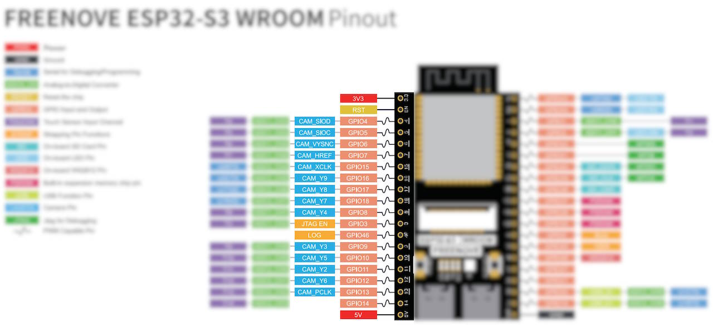
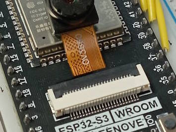
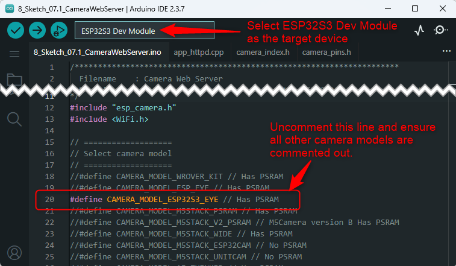
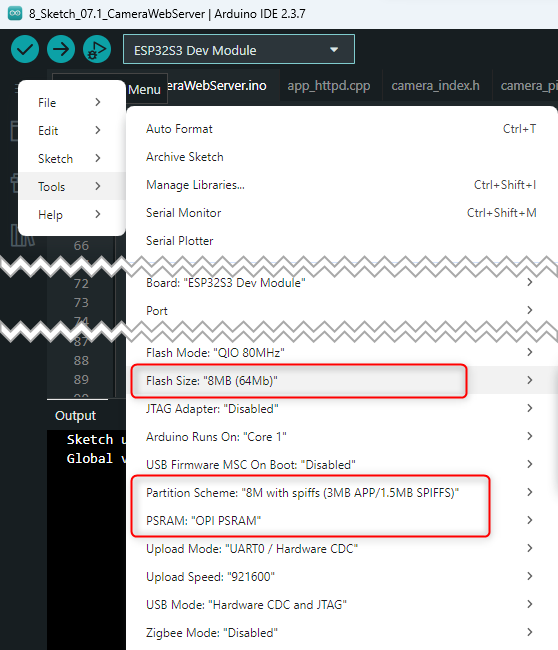
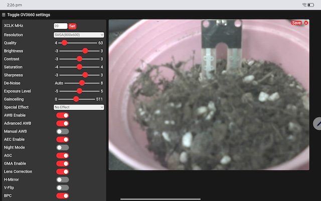

# Challenge 2: Adding a camera to take pictures of your plant

## Hardware Setup for the Camera

The Freenove ESP32-S3 board comes with a camera module. To get it working, you need to connect it correctly. The camera connects to a specific set of pins on the board.



1. **Identify the Camera Connector:** Locate the camera connector on the ESP32-S3 board. It's a small, flat flex cable connector.

2. **Connect the Camera:** Carefully insert the camera's ribbon cable into the connector. Ensure the blue tab on the cable is facing away from the board and the contacts are facing down. Secure the latch on the connector.

   

### Testing the Camera Web Server

The first program is to walk you through the basic setup to run a web server on the ESP32-S3. This program will stream live video from the camera which you can view in a web browser. The full source code is available in the `Code/8_Sketch_07.1_CameraWebServer/` folder. The example is copied from the standard program `Sketch_07.1_CameraWebServer` released by Freenove in his C_Tutorial that you may download it from https://freenove.com/fnk0085.

1.  **Select the Correct Camera Model:**
    In the `8_Sketch_07.1_CameraWebServer.ino` file, you need to uncomment the line that defines the camera model for your board. For the Freenove ESP32-S3 board, the correct model is `CAMERA_MODEL_ESP32S3_EYE`.

Make sure this line is active in your `.ino` file:
```cpp
#define CAMERA_MODEL_ESP32S3_EYE
```
    Ensure all other camera model definitions are commented out. This definition tells the compiler to use the correct pin configuration from the `camera_pins.h` file.




2. **Enter Wi-Fi Credentials:**
   Just like the ThingSpeak project, you need to provide your Wi-Fi network's SSID and password. Find these lines and update them:

   ```cpp
   const char* ssid = "REPLACE_WITH_YOUR_SSID";
   const char* password = "REPLACE_WITH_YOUR_PASSWORD";
   ```

3. **Upload and Run:**

   - In the Arduino IDE, make sure you have selected the **ESP32S3 Dev Module** board and the correct COM port.

   - From Tools:

     - Set Flash Size to "8MB (64Mb)"

     - Partition Scheme: "8M with spiffs (3MB APP/1.5MB SPIFFS)"

     - PSRAM: "OPI PSRAM"

   

   - Upload the sketch to your board.

   - Open the Serial Monitor and set the baud rate to **115200**.

   - When the board connects to your Wi-Fi, it will print its IP address to the Serial Monitor.

   ```
   Camera Ready! Use 'http://xxx.xxx.xx.xxx' to connect
   ```

4. **View the Video Stream and Get Still Image:**

   - Open a web browser on a device that is connected to the **same Wi-Fi network** as the ESP32-S3 board.
   
   - Enter the IP address shown in the Serial Monitor to the web browser's search bar and press enter.
   
   - You will see a control panel at the left. Scroll down the screen a little bit you will see the **Get Still** and **Start Stream** buttons. Press the **Start Stream** button.
   
     
   
   - If you see a live video stream, congratulation! Pressing the **Get Still** button will freeze the streaming but the picture is not stored in your machine yet. To save the picture, you need to press on the little Save button at the top right of the picture. 
   
     

### Integrate the camera web server with the main application

This completes the second challenge. You have successfully tested the camera and can stream video now. This gives your Smart Flowerpot the ability to visually monitor your plant. In the next step, we will explore how to capture images and save them to Google Drive and ThingSpeak, which will be a crucial part of the final application.

**Next:** Proceed to [Challenge 3](../docs/4.3_Challenge3_Uploading_the_images_to_GoogleDrive.md) to upload the images to Google Drive and ThingSpeak.
