# Challenge 3: Uploading Images to Google Drive and ThingSpeak

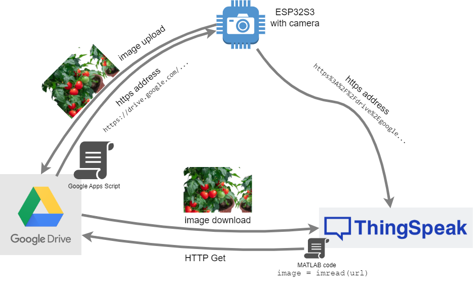

## Background

In this challenge, we will integrate a camera into our main application. To make this complex task more manageable and easier to debug, we will approach it in three parts.

### Part 1: Manual Image Capture and Saving to SD Card

**The source code for this part is available in the `Code/9_Images_SnapShot_to_SDCard/` folder.**

First, format an SD Card to FAT32.

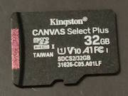

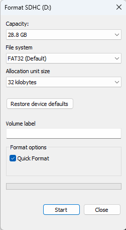

Next, insert the SD card into the SD Card socket on your board.

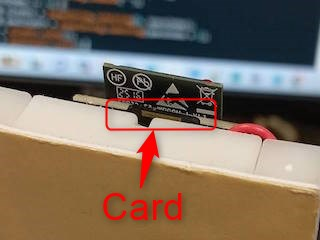

After loading the program onto the ESP32-S3, open the Serial Monitor. You will see the following messages from the `setup()` function:

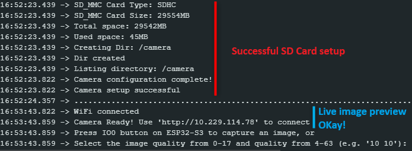

You can capture an image and save it to the SD Card in one of two ways:

1.  Press the **BOOT (IO0)** button on the ESP32-S3 board.
2.  Send a valid command through the Serial Monitor in the format `size quality`. For example, typing `10 10` and pressing Enter will set the image size to `10` (FRAMESIZE_XGA) and the JPEG quality to `10`. The valid range for `size` is 0-13, and for `quality` is 4-63. You can find the resolution corresponding to each size value in `camera_api.h`.

Here is an example of capturing an image using a serial command:

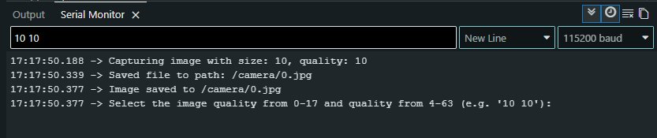

---

### Part 2: Preparing Google Apps Script and ThingSpeak

**The source code for this part is available in the `Code/10_Images_Upload_GoogleDrive_ThingSpeak/` folder.**

#### Why Use Google Drive?

While ThingSpeak can accept images, this feature requires a paid license. The entry-level academic license costs over $300 per year and limits the maximum image size to 5MB.

In contrast, a free Google account includes 15 GB of Google Drive storage. This generous storage makes the one-time effort of setting up Google Drive integration a worthwhile alternative.

The following instructions assume you have a Google account.

#### Setting Up the Google Drive Uploader

We cannot upload a file directly from the ESP32-S3 to Google Drive. Instead, we need an intermediary web service that can receive the image data and use the Google Drive API to save it. **Google Apps Script** is the perfect tool for this job.

1.  Go to your Google Drive, click **New > More > Google Apps Script**, and open a new script project.
    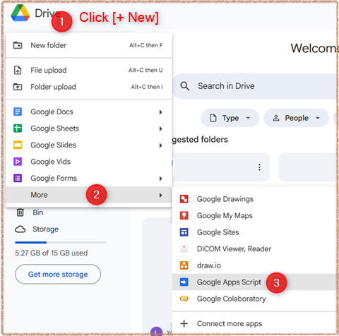

2.  Give your project a descriptive name, such as "ESP32-S3 Image Uploader".

3.  Replace the placeholder `myFunction` code with the following script:

    ```javascript
    function doPost(e) {
      if (!e || !e.postData || !e.postData.contents) {
        // Return an error if no data is received
        return ContentService
          .createTextOutput(JSON.stringify({ status: "error", message: "No postData received" }))
          .setMimeType(ContentService.MimeType.JSON);
      }
    
      try {
        // Create unique names for the file and subfolder
        const name = Utilities.formatDate(new Date(), 'GMT+8', 'yyyyMMdd-HHmmss') + '.jpg';
        const subFolderName = Utilities.formatDate(new Date(), 'GMT+8', 'yyyyMMdd');
        const folderName = 'ESP32S3_CAM_IMG'; // Main folder
    
        // Decode the base64 image data
        const data = Utilities.base64Decode(e.postData.contents);
        const blob = Utilities.newBlob(data, 'image/jpeg', name);
    
        // Get or create the main folder
        let folder;
        const folders = DriveApp.getFoldersByName(folderName);
        folder = folders.hasNext() ? folders.next() : DriveApp.createFolder(folderName);
    
        // Get or create the daily subfolder
        let subFolder;
        const subFolders = folder.getFoldersByName(subFolderName);
        subFolder = subFolders.hasNext() ? subFolders.next() : folder.createFolder(subFolderName);
    
        // Create the file and set its sharing permissions
        const file = subFolder.createFile(blob);
        file.setSharing(DriveApp.Access.ANYONE_WITH_LINK, DriveApp.Permission.VIEW);
    
        // Generate the public URL for the image
        const fileUrl = "https://drive.google.com/uc?export=view&id=" + file.getId();
        Logger.log(fileUrl);
    
        // Return a success status and the public URL
        return ContentService
          .createTextOutput(JSON.stringify({ status: "success", url: fileUrl }))
          .setMimeType(ContentService.MimeType.JSON);
      } catch (err) {
        // Log and return any errors
        Logger.log("Error during execution: " + err.toString());
        return ContentService
          .createTextOutput(JSON.stringify({ status: "error", message: err.toString() }))
          .setMimeType(ContentService.MimeType.JSON);
      }
    }
    ```

    Save the script by pressing `Ctrl+S`.

4.  Deploy the script as a web app. Click the **Deploy** button in the top-right corner and select **New deployment**. Click the gear icon next to "Select type" and choose **Web app**.

5.  In the configuration window:
    *   **Description**: "ESP32-S3 Camera Image Uploader"
    *   **Execute as**: "Me"
    *   **Who has access**: "Anyone" (This is critical for allowing the ESP32-S3 to call the script)

6.  Click **Deploy**.

7.  Google will prompt you to **Authorize access**. Grant the script the necessary permissions to access your Google Drive.

8.  After authorization, the deployment will provide a **Web app URL**. Copy this URL. It will look like `https://script.google.com/macros/s/YOUR_DEPLOYMENT_ID/exec`.

    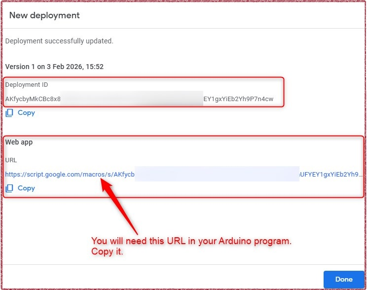

9.  Finally, create a folder in your Google Drive with the name you specified in the script (`ESP32S3_CAM_IMG`).

    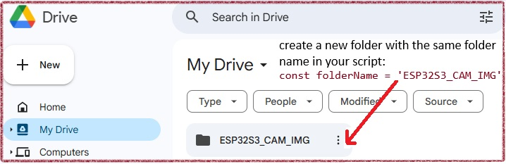

#### Updating Your Arduino Code

Before updating the code, install two libraries that is necessary for `google_drive.cpp`

* **base64** library by Densaugeo. This library is used to encode the binary image data into a Base64 string. This encoding is necessary to safely transmit the image data over HTTP to the Google Apps Script.

  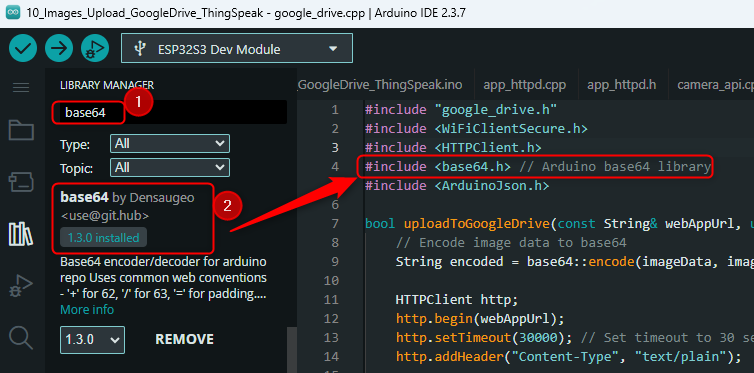

  

* **ArduinoJson** library by Benoit Blachon. This library is essential for parsing the JSON response sent back by the Google Apps Script. After the image is uploaded, the script returns a JSON object containing the status of the upload and the public URL of the image. ArduinoJson allows the ESP32 to easily extract this information.

  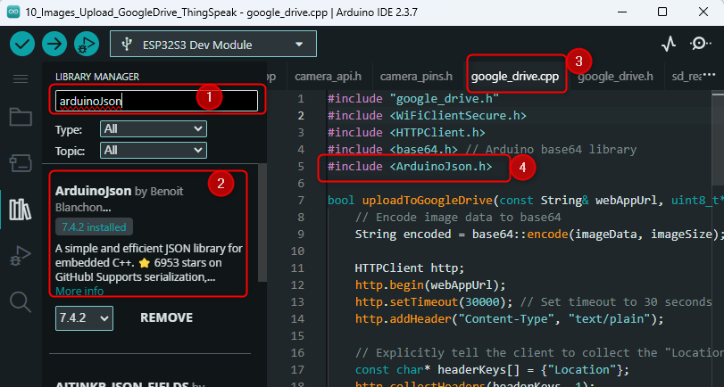

In the `10_Images_Upload_GoogleDrive_ThingSpeak.ino` file, locate the `webAppUrl` constant and paste the Web app URL you copied from the Google Apps Script deployment.

```cpp
const String webAppUrl = "https://script.google.com/macros/s/YOUR_DEPLOYMENT_ID/exec";
```

The `uploadToGoogleDrive` function (located in `google_drive.cpp`) handles the HTTP POST request to this URL, sending the image data in the request body.

At this point, you can test the Google Drive upload. The screenshot below shows the expected output in the Serial Monitor. The ESP32 first saves the image to the SD card, then uploads it to Google Drive, and finally receives a public URL (`https://drive.google.com/uc?export=view&id=1ZZZHPaHB68PO-jadtebCK03R7_k1WwP9`) in response. You can open this URL in any web browser to view the captured image.

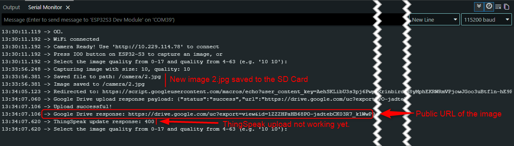

In your Google Drive, the script automatically organizes the images into daily folders, with filenames corresponding to the date and time of capture.

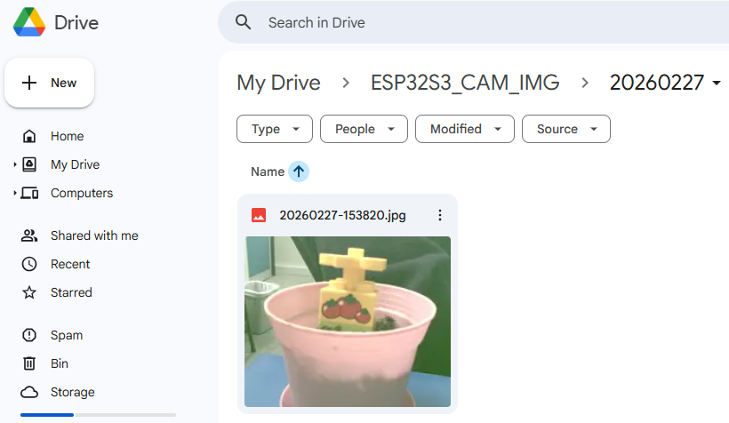


#### Uploading the Image URL to ThingSpeak

Once an image is successfully uploaded to Google Drive, the final step is to post its public URL to a ThingSpeak channel. The `uploadUrlToThingSpeak` function (in `thingspeak.cpp`) handles this by sending an HTTP GET request to the ThingSpeak API.

```cpp
// In 10_Images_Upload_GoogleDrive_ThingSpeak.ino
uploadUrlToThingSpeak(driveResponse, writeApiKey, thingSpeakFieldNumber);
```

-   `driveResponse`: A string containing the image URL returned by our Google Apps Script.
-   `writeApiKey`: Your ThingSpeak channel's Write API Key.
-   `thingSpeakFieldNumber`: The field number in your ThingSpeak channel where you want to store the URL (e.g., Field 2).

To display the image, you first need to configure your ThingSpeak channel. For this example, we will use **Field 2** and name it **ESP32_Image**. Make a note of this name, as you will need it for the MATLAB script.

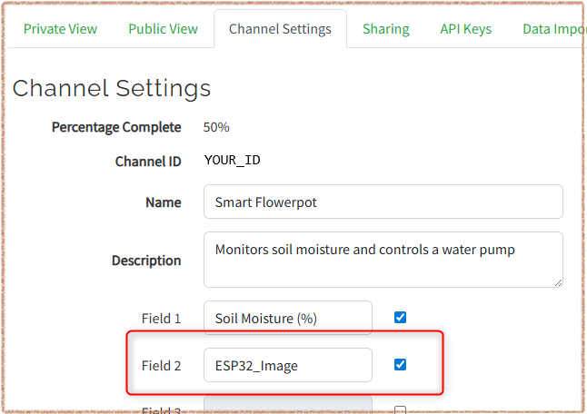

Next, we will write a short MATLAB script to fetch and render the image. In your ThingSpeak channel, navigate to **Apps > MATLAB Visualizations** and create a **New** visualization, selecting the template with **no starter code**.

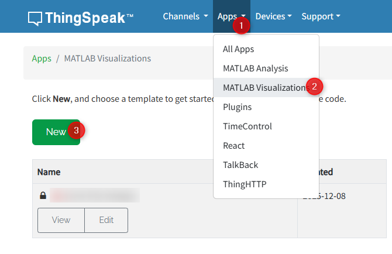 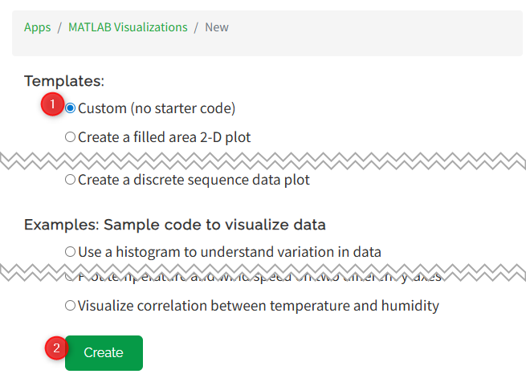

Give the visualization a descriptive name, such as "ESP32-S3 Image Uploader," and enter the following code:

```javascript
% Read the latest image URL from ThingSpeak
readChannelID = YOUR_CHANNEL_ID;

fieldNum = 2;   % replace this with your field number

readAPIKey = 'YOUR_READ_API_KEY'; % Replace with your read API key

data = thingSpeakRead(readChannelID, 'Fields', fieldNum, 'NumPoints', 1, ...
    'OutputFormat', 'table', 'ReadKey', readAPIKey);

url = string(data.ESP32_Image); % Use the actual column name
img = imread(url);
imshow(img);
title('Latest Uploaded Image');
```

> **Note:** In the line `url = string(data.ESP32_Image);`, the name `ESP32_Image` must exactly match the field name you defined in your channel settings.

#### Final Configuration and Testing

Before you test, you need to update the placeholders in your code:

1. **In the MATLAB script:** Replace `YOUR_CHANNEL_ID` and `YOUR_READ_API_KEY` with your actual ThingSpeak channel ID and Read API Key. Press **Save and Run**.
3. **In the Arduino code (`.ino` file):** Locate `ssid`, `password`, `writeApiKey`, and the `webAppUrl` constant values and replace the placeholders with your credentials. Save the file and upload the sketch to your ESP32-S3.

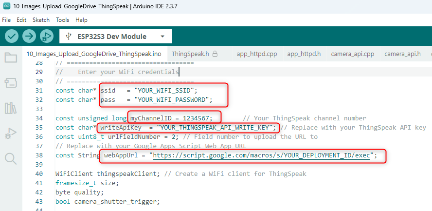

After uploading the final code, trigger an image capture. The new image will appear in your Google Drive and ThingSpeak channel visualization.

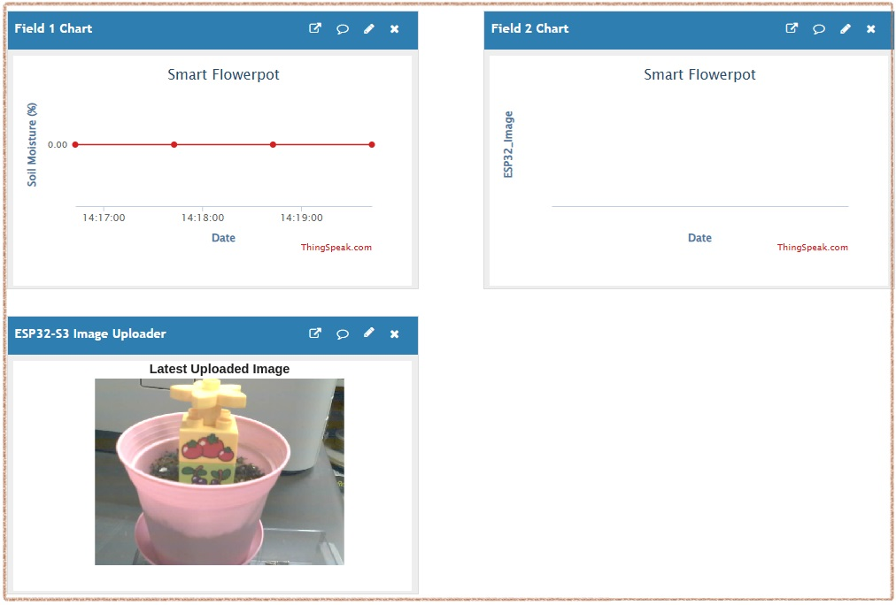

### Part 3: Integrating Image Upload into the Main Application

Once the manual trigger works reliably, the final step is to integrate this functionality into the main smart planter application (based on the code from `7_Run_WaterPump_with_Millis_ESP32`).

In the final version, the camera will automatically capture and upload an image whenever an abnormal condition is detected, such as when the soil moisture drops below a set threshold. This provides a valuable visual record corresponding to the sensor data.

**Procedures:**

1. Open `7_Run_WaterPump_with_Millis_ESP32.ino` to **Save As...** a new project e.g. `11_WaterPumpControl_and_ImageUpload.ino`

   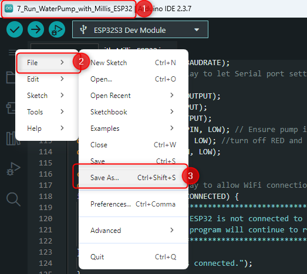

2. Manually copy all `.cpp` and `.h` driver source files from `10_Images_Upload_GoogleDrive_ThingSpeak` to the newly created `11_WaterPumpControl_and_ImageUpload` project folder.

   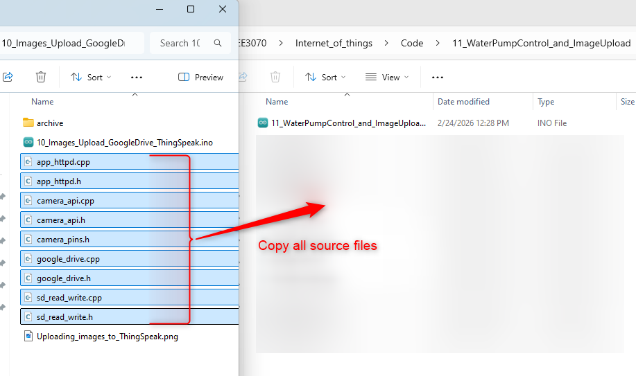
   
3. Include the necessary header files and define the URL field number `urlFieldNumber` and  `webAppUrl` constants in the Arduino sketch as shown below:
   
   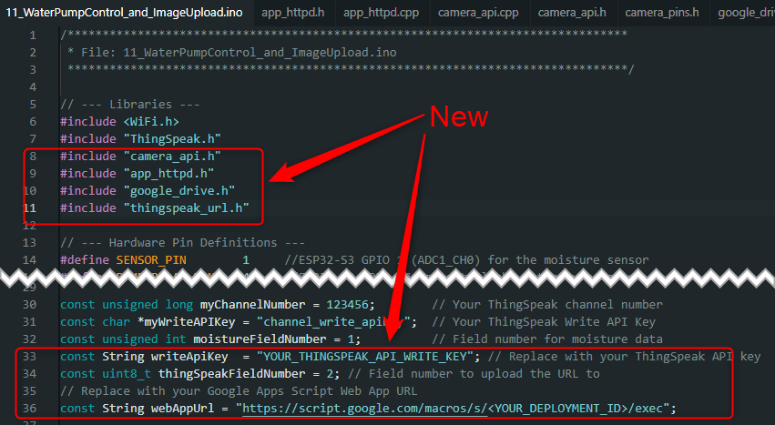
   
   
   
4. Copy the initialization code for the SD Card and Camera from project `10_Images_Upload_Google_Drive_ThingSpeak`.
   
   
   
   
   
5. Add support for the camera web server by calling `startCameraServer()` after a successful WiFi connection.
   
   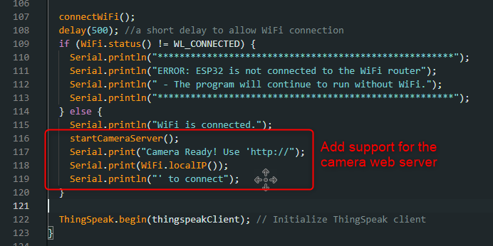
   
   
   
6. Create a new function to take a snapshot and upload the image to Google Drive and ThingSpeak. This function is a simplified version of the one used in `10_Images_Upload_GoogleDrive_ThingSpeak.ino`.
   
   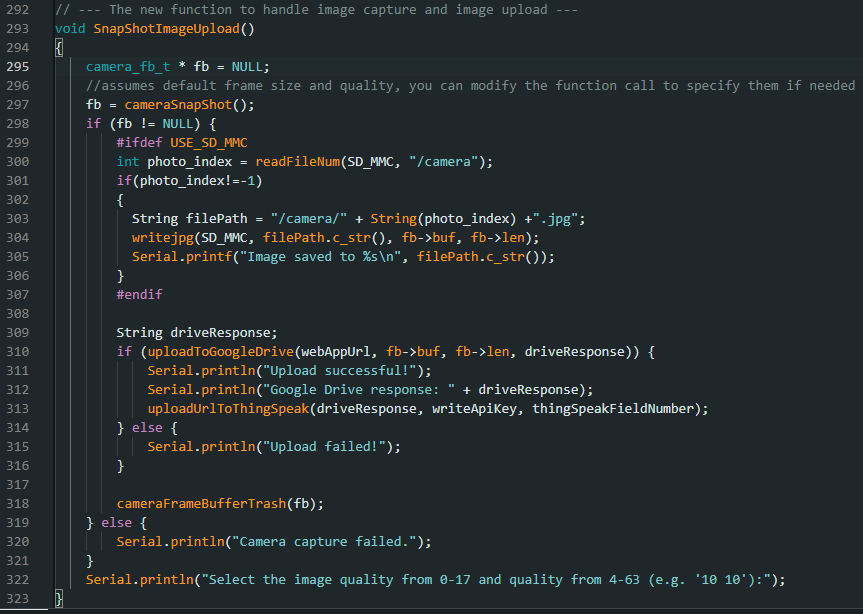

   
   
7. Finally, decide when to call the snapshot function. A suitable moment is right after the soaking process begins, as this part of the code runs in a non-blocking manner.
   
   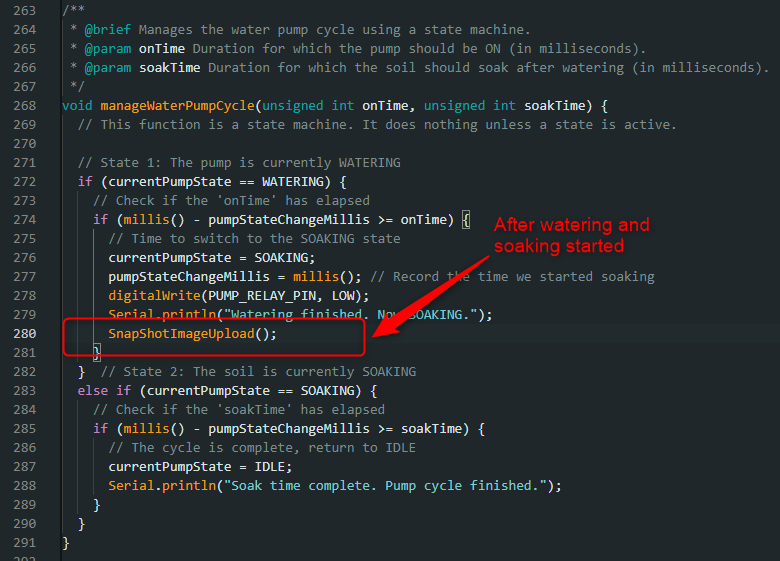
   
   
   
8. **Testing and Verification:** After integrating the code, thoroughly test the system to ensure that the water pump control and image upload functionalities work as expected.
   
   
   
   
